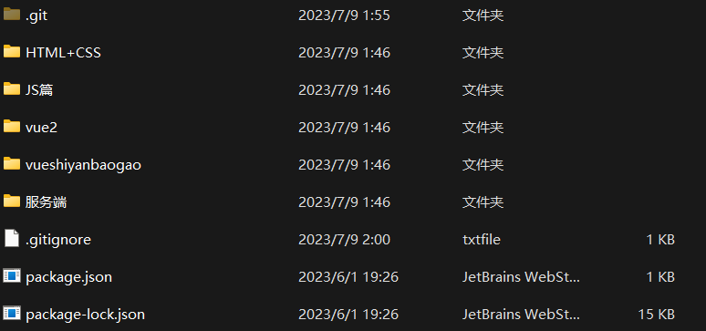
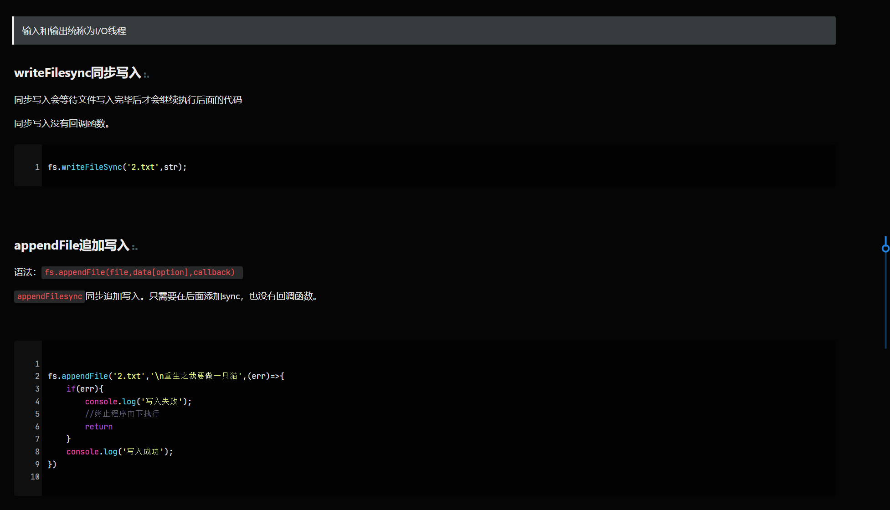
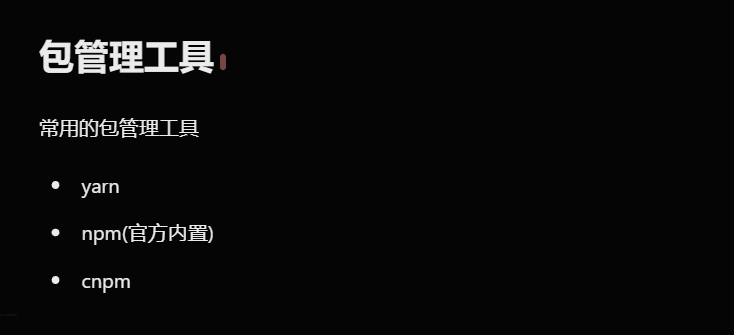
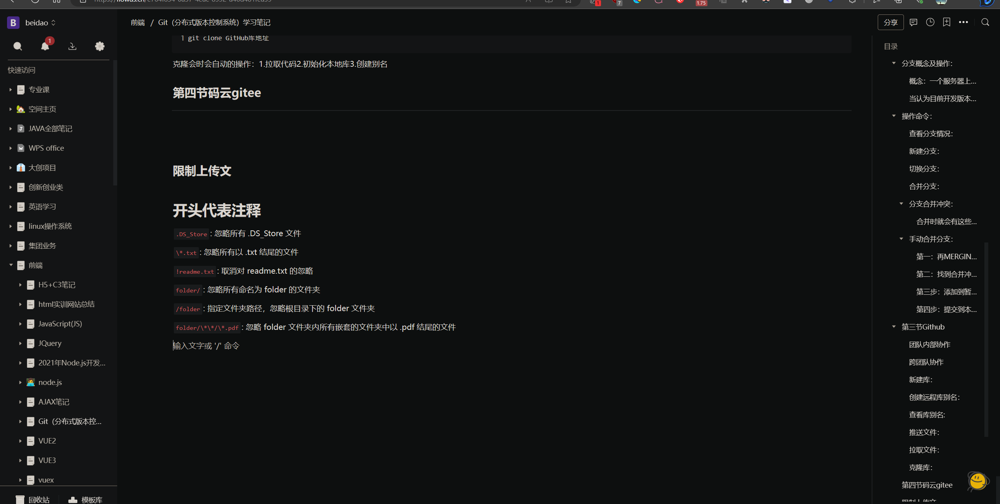
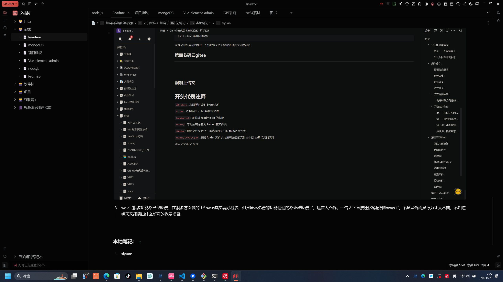

# Readme

# 前端自学文件

由于早年在自学的时候对前端的学习没有任何的规划与规范，留下了这一对屎山级别的文件和代码。

​​

‍

这个库里的文件内容很多包含了从一概不知，到渐渐的了解到前端的概况。重点不是库里的代码，其实没什么价值。

‍

# 前端自学路线的探索

在开启前端的学期之前就在百度上搜索相关的内容，看到了很多大神给出的学习路线。但大多都是与当前时间有些遥远，某些已经淘汰或者很少使用的技术仍然在推荐学习的路线上，导致学习的时候不仅不知道有什么用，也不知道该如何去学习。

‍

> 下面我就给出我在这条路上探索出的一些经验。

‍

## 1.确定是否真的要学前端

前端的技术栈非常的多，类似于十几种技能的排列组合。没有固定的最优解，技术栈的需求会根据时间，公司等进行变更，选择起来相当相当的让人秘密。

‍

学习的过程中的方法与很多之前在高中阶段不太一样。在学习js的途中发现很技术的出现和使用并不是一个线性的递进形式，而是突然出现，然后在这个阶段就不太好去理解，就感觉越学越难越学越难最后就不了了之了。        -------放弃过一次的牛马

‍

## 2. 开始学习前端

> 前端的世界很繁华，新技术疯狂的涌现。但掌握好底层的知识就可以以不变应万变，拥抱新技术，拥抱未来。

‍

### 记笔记

**记笔记是很重要的事情！**

在学习的过程中即使学习的时候简单，但是没有多次的练习使用还是会非常的容易忘。而笔记温故而知新。

如何记笔记？

建议少量笔记记在代码内（简单的注释作用），而代码的作用，代码的参数，补充说明，等最好是记录在笔记本。笔记不仅是文字，还可以记录图片，代码片段，别人的笔记等。

‍

用何种形式记笔记？

建议使用`块`​笔记，这类笔记基本上都支持markdown（一种笔记语法）,很适合写代码记笔记，不建议使用word，排版起来相当费劲，而且代码的展示相当的不美观

‍

markdown笔记示例：有专门的代码块，注释，特殊标记显示等功能

​​

​​

‍

> 云笔记在记录的字数超过 1万字左右，1千多个块时就会开始比较卡顿。

> 本地笔记目前在3万字，以及几十张图片下都是非常的流畅，推荐使用本地笔记，记完后导入到云笔记中

#### 云笔记

推荐使用以下的`在线云端`​来记笔记

> 云端最大的作用就是随时随地你都可以看去写，并且不会丢。可以回溯到某个版本等功能。

1. notion  (外国的笔记软件，业界内最强，国内的都有借鉴,但没有梯子等就比较难取使用)
2. flowus ( 新生代笔记，基本功能做的很好，该有的都有。导入导出做得很好)

​​

3. wolai (很多功能都已经收费，在很多方面做的比flowus其实要好很多。但是原本免费的功能慢慢的都变成收费了，逼着人充钱。一气之下直接迁移笔记到flowus了，不是差钱而是行为让人不爽，不知道明天又能搞出什么新奇的收费项目)

‍

#### 本地笔记：

1. siyuan  （国人之光，可以安装很多插件，非常的好用，自定义程度高支持GPT等功能）

​​

‍

### 编程软件

编辑器包括：

1. vscode
2. webstorm
3. ....

初学的话可以使用webstorm，所有东西都已经配置好，而vscode都需要自己配置，这两者都是很好用的神器。具体安装和使用百度上有很多教程

‍

### 学习的地方

* 哔哩哔哩大学
* w3c
* 菜鸟教程
* 大神博客
* 掘金

对于入门来说，视频是最好的学习方式，老师全程带着做，基本上跟着做就不会出现太多奇奇怪怪的问题，而且评论区一般会有解决方案。

bili大学的优点是前端的教学视频非常非常的多，每个技术都有十几个视频可以选择。如何选择确实是让人头大。

‍

我的推荐：

HTML5+CSS3      黑马pink

Javascript             黑马pink

Javascript高级     黑马pink

JavascriptES6+     尚硅谷

git 		   	     

node.js                  尚硅谷

vue.js                    尚硅谷

‍

在这途中会有很多的其他技术穿插基本上是齐全的技术栈。

> 视频只是带着大家入门，很多都只是浅层次的，更多是需要自己的兴趣去深度的探索。

> 很感谢这两家培训机构带来了这么多前端的教程，虽然实际工作中的写法和技术还是有蛮多没有讲到，但已经是能给出最多的 知识了。感谢感谢

‍

‍

未完待续....

---

---

---

‍
