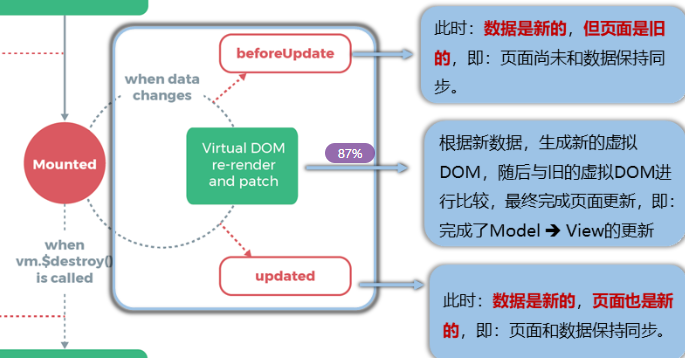
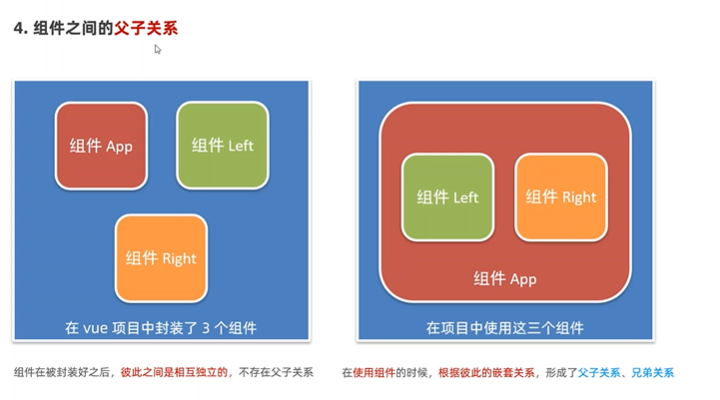
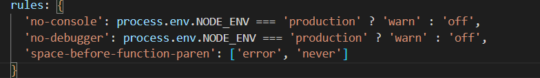
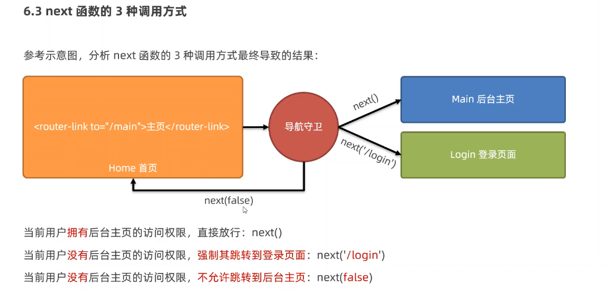
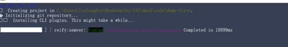

# VUE2

# vue基础知识

> Vue是一套用于构建用户界面的渐进式JS框架

Vue可以自底向上逐层的应用  

* 简单应用：只需一个轻量小巧的核心库
* 复杂应用：可以引入各式各样的Vue插件

渐进式代表可以根据业务的复杂度逐渐引进和添加引用库等工具，在小项目时是轻量化的。也可以组件升级到复杂的项目。

* 采用组件化模式，提高代码复用率、且让代码更好维护
* 声明式(简化了过程，注重业务逻辑实现)编码，让编码人员无需直接操作DOM,提高开发效率。

* vue的指令、组件（是对UI结构的复用）、路由、vuex

  数据交互才是vue的本质 ，而页面的效果更新是传值的体现

> vue框架特性：数据驱动视图  双向数据绑定

‍

### MVVM模型

‍

1. M  模型model：对应的data中的数据
2. V：视图 view 模板
3. VM视图模型  ViewModel : Vue实例对象

‍

​​

​​

‍

### 虚拟DOM

​​

‍

### 数据驱动视图

在使用了Vue的页面中，Vue会监听数据的变化，从而自动重新渲染页面的结构。

​​

好处：当页面数据发生变化时，页面会自动重新渲染！  
注意：数据驱动视图是单向的数据绑定。

‍

### 双向数据绑定

> 在网页中 form表单负责采集，ajax复杂提交数据。在填写表单时。页面上表单采集的数据发生变化的时候，会被Vue自动获取到，并更新到js数据中

​​

优点是开发者不需要再去手动操作dom元素来获取表单的最新值

‍

## 数据代理——data属性的本质

> data属性中的值就是实现原理是`Object.defineProperty`​方法所定义在实例上的属性。

数据代理的好处：更加方便的操作data中的数据

基本原理：

* 通过object,defineProperty()把data对象中所有属性添加到vm上.
* 为每·个添加到vm上的属性，都指定个getter/setter
* 在etter/setter内部去操作（读/写）data中对应的属性，

‍

结合下面这张图去理解。vm的作用就是数据代理。我们vue简化了我们对页面中的数据和js中的数据读取与修改。并且以双向性的形式体现。

​​

```js
        let class1='class4'
        let person={
            age:15,
            name:class1
        };

        Object.defineProperty(person,'name',{
            // value:"张三",
            // enumerable:true,//是否可枚举，默认false
            // Writable:true,//是否可修改，默认false
            // configurable:true,//控制属性是否可被删除，默认false

            get:function(){
                console.log("name值被修改");
                return "李四";
            },  
      
            set:function(newValue){
                console.log("name值被修改");
                console.log(newValue);
            }
                },
        );

        console.log(person);
```

​`get:function()`​和`set:function(newValue)`​方法配置项，当定义的属性被获取或者修改时都会触发这两个方法

‍

> vue中的data数据的写入和修改就是使用了这俩个方法

​​

‍

​​

‍

data挂载在了vm实例上并且名为_data:

data作为vue配置对象option传递进去

流程：vm._data=option.data=data

​​

基于配置对象传递进去的

​​

‍

​​

‍

### 数据劫持

> 在data数据被修改时，vm实例_data会劫持修改的内容从而更新模板。

数据劫持常用有三种：proxy，defineProperty，getter与setter

‍

### 引入vue

> 基于vue的文件引入，通过sript标签引入界面.

运行起来后提示：

​​

第一项是推荐安装vue 开发扩展

第二项是当前在开发模式。

‍

```js
Vue.config.productionTip=false
```

‍

### 安装vue Devtools extension

在浏览器中安装vue调试工具扩展

[vue.js_AEfp6oLAYg.crx](准备阶段+1e2cac93-6b20-4889-b71a-d231a2b642eb/vue.js_AEfp6oLAYg.crx)

配置插件

​​

​​

安装完成后还提示要安装vue tools去扩展里的详细信息中勾选

​​

‍

‍

## Vue检测数据的原理

‍

数据更新流程：

name被修改-->调用setter-->重新解析模板-->生成新的虚拟DOM-->新旧DOM对比（diff）-->更新页面

​​

‍

‍

Vue中监测数据改变的原理是通过使用**响应式系统**。

当在 Vue 实例中声明了一个数据属性时，Vue 内部会利用 JavaScript 的 `Object.defineProperty`​ 方法劫持该属性的读取(get)和修改(set)操作，并在属性被访问或修改时触发相应的更新。

具体而言，当我们在模板或组件中使用这些数据属性时，Vue 会建立起一种**依赖追踪**机制。每个数据属性都有一个对应的依赖收集器（Dep），负责存储所有依赖于该属性的 Watcher 对象。Watcher 对象又负责实际执行视图更新操作。

首次渲染时，Vue 会创建一个渲染 Watcher，在编译过程中遇到数据绑定表达式时，将其添加为当前正在计算的 Watcher 的依赖。当其中任何一个被监听的数据发生更改后，Vue 就能够通过之前建立起的依赖关系找到相关联的 Watcher，并通知它们进行更新。

‍

最终通过数据代理的形式在vue中的呈现。

```JavaScript
vm._data = data=obj
```

‍

> defineProperty中不能直接使用 this.xxx的方式调用数据，因为这样导致触发死循环，在get直接读取data中的数据，又导致get方法被调用。就这样死循环了。

代码简单实现原理：

```JavaScript
// 定义一个空对象作为存储数据的容器
const data = {};

// 将要监听的属性名定义为常量
const key = 'message';

// 使用 Object.defineProperty 监听属性访问和修改操作
Object.defineProperty(data, key, {
  enumerable: true,
  configurable: true,
  get() {
    console.log(`获取属性 ${key}: ${data[key]}`);
    return data[key];
  },
  set(newValue) {
    console.log(`设置属性 ${key} 值为: ${newValue}`);
    data[key] = newValue;
  }
});

// 创建 Vue 实例，并将 data 对象赋值给 vm._data 属性
const vm = {};
vm._data = data;

// 修改数据会触发 set 方法
vm._data.message = 'Hello World';

// 访问数据会触发 get 方法
console.log(vm._data.message);
```

‍

‍

在Vue中，数据变化检测是通过Vue的响应式系统实现的。Vue会在初始化阶段将data中的数据转换为响应式对象，从而能够追踪数据的变化，并在数据发生改变时更新相关的视图。

### 检测对象的变化

Vue使用了ES5的`Object.defineProperty`​方法来实现对对象属性的拦截和监听。当你修改一个响应式对象的属性时，Vue会捕获到这个变化并触发相应的更新。

下面是一个简单的示例代码，演示如何在Vue中检测对象的变化：

```html
<div id="app">
  <p>Name: {{ person.name }}</p>
  <p>Age: {{ person.age }}</p>
  <button @click="changeName">Change Name</button>
</div>
```

```javascript
// 创建一个Vue实例
new Vue({
  el: '#app',
  data() {
    return {
      person: {
        name: 'John',
        age: 25,
      },
    };
  },
  methods: {
    changeName() {
      // 修改person对象的name属性
      this.person.name = 'Alice';
    },
  },
});
```

在上述代码中，我们创建了一个Vue实例，并在data中定义了一个person对象。当点击"Change Name"按钮时，调用`changeName`​方法修改了`person`​对象的`name`​属性。由于Vue会追踪对象属性的变化，它会自动更新相关的视图，显示新的名字。

‍

### 检测数组的变化

对于数组，Vue使用了一些特殊的方法来实现对数组的变化进行监听。

这些方法包括`push()`​、`pop()`​、`shift()`​、`unshift()`​、`splice()`​、`sort()`​和`reverse()`​等。当你使用这些方法修改数组时，Vue会捕获到这些变化并更新相关的视图。

‍

> 这里的数组方法跟Array.prototype.xxx原型链上的方法是不相等的，而是Vue包装了这些原型方法，然后挂载在vue对象上的由vue管理的方法。所以就可以检测到调用了这些方法从而进行数据代理。更新模板。

‍

1. 包装push方法
2. 调用push方法
3. 更新模板

​​

‍

‍

下面是一个简单的示例代码，演示如何在Vue中检测数组的变化：

```html
<div id="app">
  <ul>
    <li v-for="item in list" :key="item.id">{{ item.name }}</li>
  </ul>
  <button @click="addItem">Add Item</button>
</div>
```

```javascript
// 创建一个Vue实例
new Vue({
  el: '#app',
  data() {
    return {
      list: [
        { id: 1, name: 'Apple' },
        { id: 2, name: 'Banana' },
        { id: 3, name: 'Orange' },
      ],
    };
  },
  methods: {
    addItem() {
      // 向list数组中添加一个新项
      this.list.push({ id: 4, name: 'Grape' });
    },
  },
});
```

在上述代码中，我们创建了一个Vue实例，并在data中定义了一个list数组。通过使用`v-for`​指令将数组中的每个元素渲染为列表项。当点击"Add Item"按钮时，调用`addItem`​方法向`list`​数组中添加一个新项。由于Vue会追踪数组的变化，它会自动更新相关的视图，添加新的列表项。

总结：Vue通过使用Object.defineProperty方法对对象属性进行拦截和监听，以及使用特殊的数组方法来追踪数组的变化，实现了数据的变化检测和视图的自动更新。这样，当数据发生改变时，Vue能够及时更新相关的视图，保持数据和视图的同步。

‍

修改对象和修改数组的代码演示。

```js

<!DOCTYPE html>
<html lang="en">
  <head>
    <meta charset="UTF-8" />
    <meta name="viewport" content="width=device-width, initial-scale=1.0" />
    <title>Document</title>
  </head>
  <body>
    <script src="../vue.js"></script>

    <div id="app">
      <h1>修改信息演示</h1>

      <p>名字：{{wuitStuend[0].name}}，爱好：{{ wuitStuend[0].hobby}}</p>
      <!-- 当属性不存在时就不显示 -->
      <p v-if="wuitStuend[0].age">{{wuitStuend[0].age}}</p> 
      <button @click="sethobby()">添加年龄属性</button>
      <button @click="setarr()">添加兴趣</button>

    </div>

    <script>
      const vm = new Vue({
        el: "#app",
        data() {
          return {
            wuitStuend: [
              { id: 1, name: "华明", hobby: ["唱", "跳", "rap"] },
            ],
          };
        
        },
        methods:{
          sethobby(){
            //使用set方法改变给对象在后续添加值
            //this指向vm实例
            console.log(vm);
            //在vm上这个方法叫$se
            this.$set(this.wuitStuend[0],"age",19)
            console.log(this.wuitStuend[0]);
          },
          setarr(){
            //添加属性
            this.wuitStuend[0].hobby.push("打游戏")
          }
        }
      });
    </script>
  </body>
</html>

```

‍

## Vue.set

> 在代码已经执行中向vue实例中添加数据的方法。

‍

### [Vue.set( target, propertyName/index, value )](https://v2.cn.vuejs.org/v2/api/#Vue-set)

* **参数**：
* ​`{Object | Array} target`​​
* ​`{string | number} propertyName/index`​​
* ​`{any} value`​​
* **返回值**：设置的值。
* **用法**： 向响应式对象中添加一个 property，并确保这个新 property 同样是响应式的，且触发视图更新。它必须用于向响应式对象上添加新 property，因为 Vue 无法探测普通的新增 property (比如 `this.myObject.newProperty = 'hi'`​​)

‍

```js
            this.$set(this.wuitStuend[0],"age",19)
```

‍

代码实例

```js

<!DOCTYPE html>
<html lang="en">
  <head>
    <meta charset="UTF-8" />
    <meta name="viewport" content="width=device-width, initial-scale=1.0" />
    <title>Document</title>
  </head>
  <body>
    <script src="../vue.js"></script>

    <div id="app">
      <h1>修改信息演示</h1>

      <p>名字：{{wuitStuend[0].name}}，爱好：{{ wuitStuend[0].hobby}}</p>
      <!-- 当属性不存在时就不显示 -->
      <p v-if="wuitStuend[0].age">{{wuitStuend[0].age}}</p> 
      <button @click="sethobby()">添加年龄属性</button>

    </div>

    <script>
      const vm = new Vue({
        el: "#app",
        data() {
          return {
            wuitStuend: [
              { id: 1, name: "华明", hobby: ["唱", "跳", "rap"] },
              { id: 2, name: "张三", hobby: ["篮球", "游泳", "写作"] },
              { id: 3, name: "李四", hobby: ["画画", "旅行", "弹吉他"] },
              { id: 4, name: "王五", hobby: ["看电影", "打乒乓球", "编程"] },
              { id: 5, name: "赵六", hobby: ["阅读", "健身", "烹饪"] },
              { id: 6, name: "陈七", hobby: ["摄影", "钓鱼", "唱歌"] },
              { id: 7, name: "刘八", hobby: ["滑雪", "写诗", "登山"] },
              { id: 8, name: "黄九", hobby: ["骑自行车", "听音乐", "下棋"] },
              { id: 9, name: "周十", hobby: ["观星", "游戏", "编织"] },
              { id: 10, name: "郑十一", hobby: ["滑板", "画漫画", "打羽毛球"] },
            ],
          };
        
        },
        methods:{
          sethobby(){
            //使用set方法改变给对象在后续添加值
            //this指向vm实例
            console.log(vm);
            //在vm上这个方法叫$se
            this.$set(this.wuitStuend[0],"age",19)
            console.log(this.wuitStuend[0]);
          }  
        }
      });
    </script>
  </body>
</html>

```

‍

直接 向vue实例添加变量，这个变量是没有get和set，也没有响应式，所以无法呈现在页面上

​​

‍

所以这种方式是不行的。

‍

> vue中的data是经过defineProperty后代理到vm实例上才是实现的set和get。

‍

使用vue.set方法去添加数据就可以像在data中添加一样。

‍

### 缺点：

‍

> 不可以直接向vm实例和data根数据上直接加属性

* 注意vue.set的对象不能是 Vue 实例，或者 Vue 实例的根数据对象。

‍

# 使用vue

- 引入vue.js
- 实例化vue对象
- 创建vue模板容器（#root）
- 内容都需要放在模板容器中才生效
- 容器内的表达式可以是js内置函数，或者是自定义数据

> el是固定的写法，表示当前vm实例要控制页面上的哪个区域，接收值是一个选择器，el控制的是一个区域，id为app的标签 的子标签都可以直接使用data里面的数据

‍

data属性挂载在vm实例上。在H5标签中可以访问到data中的数据

```HTML
    <script src="./vue.js"></script>
    <div id="root">这是第一个vue代码
        <div>内容：{{saying}}</div>
    </div>
    <script>
        //创建vue示例并传一个对象参数，里面是vue设定好的配置，我们按照需要来选
       const vm= new Vue({
            //指定vue实例内容放在哪个容器内
            el: '#root',
            //data是存放页面数据的地方。
            
            data: {
                saying: 'first try'
            }
        })
    </script>
```

- el为控制区域（cs选择器），data为渲染数据

date是配置，{}是配置对象，因为只是在用vue的api，并没有创建新的东西，所以是按照他们的规则来写

- <div>
  <div id="becon">{{ username }}</div> HTML写法
  </div>

‍

实现原理在代码中的体现


## 挂载的写法

对象写法

```js
       const vm= new Vue({
            //指定vue实例内容放在哪个容器内
            el: '#root',
            //data是存放页面数据的地方。
          
```

‍

‍

el的第二中写法 挂载

在vm对象之外进行挂载,可以对挂载时间等进行额外操作。

```JavaScript

    <div id="app2">
        {{message}}
    </div>

        const vm2 =new Vue({
            data() {
                return {
                    message:"插值表达式",
                    agc:"abcd",
                    xingchuangAI:{
                        URL:"https://www.baidu.com",
                        Description:"百度一下，你就知道"         
                    },
                    username:""
                };
            },
        }).$mount("#app2")

或者

vm2.$mount("#app2")
```

‍

## data的写法

第一种写法，对象式

```js
            //data是存放页面数据的地方。
          
            data: {
                saying: 'first try'
            }
```

‍

date的第二种写法 函数式。以后都使用这种方式

在多组件开发时，存在都需要调用同一个数据，在其他组件中需要引用，然而JS一般都会将对象的地址传输过去而不是拷贝对象，就导致了在其他组件中会修改到源数据

```JavaScript
          data() {
                console.log(this);
                return {
                    name: 'zhangsan'
                }
            }
```

使用函数式写法是直接返回一个新的对象，新的地址。从而不会影响其他数据

‍

‍

引用关系

​​

‍

## JS表达式与语句

表达式：一个表达式会生成一个值，可以放在需要返回值的地方

js代码：执行一个操作，不一定有返回值。

‍

## Vue基本注意事项

‍

* vue实力和容器是一一对应的
* 实际开发中只有一个vue实例，由实例配合组件使用
* 由Vue管理的函数不要写箭头函数例如  data(){},会导致this指向问题

‍

# vue指令 directive 

指令(Directives)是vue为开发者提供的模板语法，用于辅助开发者渲染页面的基本结构。

使用指令后都能接收并使用到data中的数据。并且还可以作为js表达式调用js方法。

指令可以用于解析标签，包括：标签属性，标签体内容，绑定事件

Vue中的指令按照不同的用途可以分为如下6大类：

- 内容渲染指令
- 属性绑定指令
- 事件绑定指令
- 双向绑定指令
- 条件渲染指令
- 循环渲染指令

‍

## {{}}内容渲染指令

> 把内容渲染到绑定指令的标签中

* {{ }}  （插值表达）
* v-text
* v-html

‍

### 指令语法

v-text（几乎不用）

> 会覆盖元素内部有的内容

```HTML
        <!-- 这个是vue内容渲染指令，属性值就属性名 -->
        <p v-text="username"></p>
        <!-- v-text会覆盖原本标签中的内容 -->
        <p v-text="sex">这里的内容会被覆盖</p>
```

v-html

> 可以插入html标签

```HTML
        <!-- 可以插入html标签 -->
        <div v-html="info"></div>
        
         info: '<h4 style="color: red;font-weight: 400;">这是vue控制的标签</h4>'


```

‍

### 插值语法

‍

{{}}  插值表达式

> 不会覆盖内容，加到元素内容节点中的任意位置，但不能加到属性里，可以写js表达式的运算，简单的加间和三元运算，数组方法这些。括号内按照js代码处理

​`调用方法时，会按照表达式标准去执行，执行完后返回值，包括调用方法`​

```HTML
        <!-- 差值表达是把数据插入到标签内如中的某个位置 -->

        <p>姓名：{{username}}</p>
        <p>性别：{{sex}}</p>
        <p>1+2={{1+2}}</p>
   <!-- 使用插值表达式 。插值表达式的内是JS表达式-->
        <p>{{tips}} 翻转的结果是{{tips.split('').reverse().join()}}</p>
 


```

调用函数并且输出返回值

```Vue
        <button>{{showinfo()}} 插值表达式运用</button>

            methods: {
                showinfo(){
                    console.log("press");
                }
            },

```

‍

‍

‍

## v-bind属性绑定指令

v-bind:   动态解析标签，包括标签属性，标签体内容，绑定事件，

**单向的数据绑定。只能从data到页面**，不能从页面到data.主要用于将h5标签的属性值设置为data中的值

简写（:） 添加指令后，就把属性值当作js表达式去处理了


可以用在字符串拼接，字符串需要加单引号 和变量拼接来修改标签属性值，

```HTML
        <input type="text" v-bind:placeholder="tips">
        
        <div :title="'box-'+index "></div>
        

```

```JavaScript
         data: {
                tips: "请输入用户名",
                weilogo: '../firstday/upload/weixin.png',
            }
```

‍

### 用于动态绑定CSS样式

> v-bind绑定class属性在data中以字符串数组或单个变量的形式的形式来插入到class属性中，从而实现动态的绑定样式，后续升级维护更换都很方便，推荐使用。

- 绑定class
- 绑定style，优点是可以直接在vue的管理中修改样式。

数组在不确定个数的样式下使用，如果能确定名字可以使用单个变量

#### 字符串写法，

适用于：样式的类名不确定，需要动态指定

#### 数组写法

适用于：要绑定的样式个数不确定、名字也不确定

#### 对象写法

适用于：要绑定的样式个数确定、名字也确定，但要动态决定用不用。当data中对象的值为true时就是使用该样式。可以用于切换夜间模式。


```CSS
    <div id="app">

        <div :class="navstyle">
        <span :class="spanstyle">这是内容</span>
        <span>这是内容</span>
        <span>这是内容</span>
<br>
<br>
<br>
<br>
<br>
<br>

        </div>
        <div :class="bodystyleobj">

        </div>
   
        </div>
    </div>
```

```CSS
        const v = new Vue({
            el: "#app",
            data() {
                return {
                   navstyle:["red","fontcolor","border1","bordercolorbisque"],
                   spanstyle:"spanfontsize",
                    bodystyleobj:{
                    bodystyleobj2:true,
                    bodystyleobj1:false
                }
                };
            },
        });
```

```CSS
    <style>
.red{
    background-color: red;
}
.fontcolor{
    color: yellowgreen;
}
.border1{
    border: 1px solid transparent;
}
.bordercoloraq{
    border-color: aqua ;
}
.bordercolorbisque{
border-color: bisque ;
}
.spanfontsize{
    font-size: 20px;
}
.bodystyleobj1{
    width: 500px;
    height: 200px;
    background-color: aqua;
    border-radius: 5px;
}
.bodystyleobj2{
width: 500px;
height: 200px;
background-color: orange;
border-radius: 5px;
}
    </style>
```

‍

## v-model双向数据绑定

> 绑定v-model内容更改，也会让数据原更改，在让页面重新渲染数据。
>
> v-bind就不会让页面重新渲染,因为不会改变数据源的值,只能和表单元素绑定(有value的),因为只有这些才是用来呈现数据的,其他的能写字,
>
> 但不是专门用于只能用在表单类元素上（输入类的），像h标签p标签都不行。 input可以包括选择和多选

‍

简写：v-model:value 可以简写成 v-model因为本身绑定的就是vlaue的值

```Vue
    <div id="app">
        <h1 style="text-align: center;">v-model的使用</h1>
        <p>展示个人信息：{{person.name}} {{person.age}} {{person.age}}
        </p>
        <input type="text" v-model="username">
       <input type="text" v-model="person2.name" placeholder="输入名称">
     <input type="text" v-model.number="person2.age" placeholder="年龄">
        <input type="text" v-model="person2.class" placeholder="班级">
        <p>输入用户名{{username}}</p>
 <p>展示个人信息：{{person2.name}} {{person2.age}} {{person2.class}}
        </p>
    </div>
    <script>
        const v = new Vue({
            el: "#app",
            data() {
                return {
                    username:"",
                    person:{
                        name:"zangsan",
                        age:18, 
                    },
                    person2:{
                        name:"",
                        age:null,
                        class:""
                    }
                }
            },

        });
    </script>
```


V-model可以获取到子元素的value

```HTML
         <!-- vue获取的数据 获取的是value的值 -->
        <select name="" id="" v-model="cities">
            <option value="shang">上海</option>
            <option value="nan">南宁</option>
            <option value="bei">北京</option>
            <option value="guang">广州</option>

        </select>
```

### V-model绑定表单的特殊设置

‍

1. 提交无需使用表单默认设置而是使用vue函数。

    函数提交：组织页面刷新，可以进行其他函数操作（提示提交完成等）。
2. 表单信息一般存储在一个userinfo对象方便管理
3. 单选框需要单独赋值`value`​再绑定`v-model`​才能收集到信息。
4. (age)数字类的需要双重验证
5. 多复选框需要的`value`​和`v-model`​要绑定数组，但复选框不需要。
6. 下拉选择`v-mode`​l绑定的是`select`​标签，`value`​在选项上
7. 文本框类的最好都加`.tram.lazy`​修饰.去空格和懒加载
8. ​`@submit.prevent="submitForm"`​提交时就会触发这个函数

‍

```html
<!DOCTYPE html>
<html lang="en">
<head>
    <meta charset="UTF-8">
    <meta name="viewport" content="width=device-width, initial-scale=1.0">
    <title>Document</title>
    <script src="../vue.js"></script>
</head>
<body>

  <div id="app">
    <h2>用户信息</h2>
    <!-- 通过vue管理，提交时就会触发这个方法并且阻止刷新，开发中就是直接无刷新提交2 -->
    <form @submit.prevent="submitForm">
      <label for="name">姓名：</label>
      <input type="text" id="name" v-model.tram.lazy="formData.name" required >

      <br>
      <label for="email">邮箱：</label>
      <input type="email" id="email" v-model.tram.lazy="formData.email" required lazy>

      <br>
      <label for="age">年龄：</label>
      <!-- 设置为number属性，并且v-model.number的二次检测确保数据准确 -->
      <input type="number" id="age" v-model.number.tram.lazy="formData.age" required>

      <br>
      <label for="gender">性别：</label>
      <select id="gender" v-model="formData.gender" required>
        <option value="">请选择</option>
        <option value="male">男</option>
        <option value="female">女</option>
      </select>

      <br>
      <!-- 单个复选框只需管关注true -->
      <label for="subscribe">订阅：</label>
      <input type="checkbox" id="subscribe" v-model="formData.subscribe">
<br>
<!-- 多复选框需要绑定数组 -->
        <label for="hobby">爱好：</label>
        <br>
        <input type="checkbox" id="sing" value="唱歌" v-model="formData.hobby">
        <label for="sing">唱歌</label>
        <input type="checkbox" id="dance" value="跳舞" v-model="formData.hobby">
        <label for="dance">跳舞</label>
        <input type="checkbox" id="rapsinger" value="rap" v-model="formData.hobby">
        <label for="rapsinger">rap</label>
      <br>
      <button type="submit">提交</button>
    
      <br>
    </form>
  </div>

<script>
const vm=new Vue({
    el:"#app",
    data() {
    return {
      formData: {
        name: '',
        email: '',
        age: null,
        gender: '',
        subscribe: false,
        hobby:[]
      }
    };
  },
  methods: {
    submitForm() {
      // 在这里处理表单提交逻辑
      console.log(this.formData);
     const userinfojson= JSON.stringify(this.formData)
      console.log(userinfojson);
    }
  }
}) 
 

</script>

  
</body>
</html>
```

‍

### V-model绑定表单时的修饰符

将输入的值转化为数字

> 表单和输入框获取的值一般都是字符串的,

```HTML
 <input type="text" name="" id="" v-model.number="age2">
```

去除输入值两端的空格

```HTML
<input type="text" v-model.trim="username">
```

延迟数据更新

> 一般情况下v-model是实时把修改的数据给回数据源进行改变,改一个字就返回一次,用延迟是改完后失去表单焦点才给回数据源

```HTML
  <input type="text" v-model.lazy="username">
```

‍

‍

## v-if-show条件渲染指令

> 当条件为true才会进行渲染，false时就会隐藏，

### v-if

> V-if的原理是：每次动态创建或移除元素，实现元素的显示和隐藏  
> 如果刚进入页面的时候，某些元素默认不需要被展示，而目后期这个元素很可能也不需要被展示出来，此时性能更好。实际开发很少关注性能问题，直接用if就行

```html
        <div v-if="n===1">zdas</div>
```

‍

当需要操作多行且同条件时，可以用template，如果使用其他的标签会导致DOM结构被破坏css样式匹配不上，而template渲染上去后就会消失

```html
      <template v-if="n==1">
        <h1>第一行</h1>
        <h1>第一行</h1>
        <h1>第一行</h1>
        <h1>第一行</h1>
        <h1>第一行</h1>
      </template>
```

‍

​​

‍

### v-show

> v-show的原理是：动态为元素添加或移除display:none样式，来实现元素的显示和隐藏。如果要频繁的切换元素的显示状态，用V-show性能会更好

```html
    <div id="app">
      <h1>条件渲染指令show和if</h1>

      <p v-show="flag">秋水共长天一色</p>
       <p v-if="flag">秋水共长天一色</p>
         
      <button @click="flag=true">显示</button>
      <button @click="flag=false">隐藏</button>
      <p>{{flag}}</p>
    </div>

    <script>
      const v = new Vue({
        el: "#app",
        data() {
          return {
            //相当于开关
            flag:true
          };
        },
      });
    </script>
```

v-else-if

> 多重判断，用的少,一定要和if搭配使用。if和v-else-if一定要连在一起写

```HTML
        <div v-if="soc==='A'">A</div>
        <div v-else-if="soc==='B'">B</div>
        <div v-else-if="soc==='C'">C</div>
        <div v-else>D</div>
```

‍

‍

‍

## 循环类列表渲染指令

> 当需要将多个数据渲染到列表时使用

v-for

> 想要重复那一段代码就给谁添加，子元素和自己本身都能访问到数据，item in list名字可以自定义的。

* list 是数组在date中的的名字，
* item是接收过来的变量名，推荐用item命名，item代表着素组里面的对象，循环第一次就是第一个对象。
* :key 属性（必须）  并且把唯一的id作为key的值(只能是字符串和数字) key可以使得页面不用完全更新，只会更新for循环的这部分。防止数据会重复导致错误。需要一个id去区分开内容。
* value是索引号，一般可以用于做为id。
* (item,value)顺序是固定的

> 可以遍历：        数组，数组对象，字符串

```HTML
  <tr v-for="item in list" :title="item.name" :key="item.id">
                    <td>0</td>
                    <td>{{item.id}}</td>
                    <td>{{item.name}}</td>
    </tr>
        <!-- index索引号是可选参数，需要时这么写， -->
        <ul v-for="(item,value) in person" :key="value">
            <li>{{item.name}}</li>
            <li>{{item.age}}</li>
            <li>{{item.class}}</li>
        </ul>
```

数据在data中的形式是数组包含多个对象，因为这是一类东西，所以具体的对象，比如张三，李四。所以都是一个对象。

```CSS
        data() {
            return {
                person: [
                {
                    name: "zangsan",
                    age: 18,
                    class: "middle"
                },
                {
                    name: "heiha",
                    age: 18,
                    class: "midd"
                },
                 {
                    name: "lisi",
                    age: 21,
                    class: "high"
                },
                 {
                    name: "wangwu",
                    age: 25,
                    class: "low"
                }
            ]
            }
        },
```

‍

‍

## V-cloak后渲染

​`v-cloak`​是Vue.js中的一个指令，用于在初次渲染页面时隐藏未编译的Vue模板。它通常与CSS样式配合使用，以防止在Vue实例挂载之前，用户能够看到未经处理的模板内容。

当Vue实例初始化时，模板中的Vue特殊语法（如双花括号插值表达式 `{{ ... }}`​）会被保留在DOM中，直到Vue完成编译和挂载过程。这意味着，在Vue实例挂载之前，模板中的Vue特殊语法会显示出来，给用户一种不完整或不一致的感觉。

为了解决这个问题，可以使用`v-cloak`​指令。使用`v-cloak`​指令时，需要配合相应的CSS样式规则，确保在Vue实例编译和挂载之前，相关元素不可见。一般的做法是给`v-cloak`​添加一个`display: none;`​的样式规则。

下面是一个示例：

```html
<style>
  [v-cloak] {
    display: none;
  }
</style>

<div id="app">
  <h1 v-cloak>{{ message }}</h1>
</div>

<script>
  new Vue({
    el: '#app',
    data() {
      return {
        message: 'Hello, Vue!'
      };
    }
  });
</script>
```

在上述示例中，`[v-cloak]`​选择器定义了`v-cloak`​指令的样式规则，将元素的`display`​属性设置为`none`​。这样，在Vue实例挂载之前，`<h1>`​标签中的内容不会显示在页面上，直到Vue完成编译和挂载过程后，才会将其显示出来。

需要注意的是，使用`v-cloak`​指令时，确保在Vue实例初始化之前，CSS样式已经加载，并且在模板中的元素上正确添加了`v-cloak`​指令。这样可以避免用户在页面渲染过程中看到未编译的Vue模板内容。

‍

## v-once初次渲染

v-once 是 Vue.js 提供的一种指令，它可以使你的模板只被渲染一次，后续的数据改变不会引起该模板的重新渲染。这使得 v-once 变成了一种性能优化的工具，特别是在渲染大量静态内容时。

这里有一个使用 v-once 的例子：

```html
<template>
  <div>
    <span v-once>{{ message }}</span>
  </div>
</template>

<script>
export default {
  data() {
    return {
      message: 'Hello, World!'
    };
  }
}
</script>
```

在这个示例中，无论 "message" 数据如何变化，插值内容 "Hello, World!" 都不会发生改变，因为它使用了 v-once 指令，只渲染一次。这可以避免不必要的DOM更新，有助于提升程序的性能。

然而，这并不表示所有的场景都应该使用v-once，如果你的数据确实需要动态变化，那么就不适合使用v-once，因为它的主要目的是在数据不会改变的前提下优化性能。

‍

## v-pre跳过编译

​`v-pre`​ 是 Vue.js 提供的一种指令，用于跳过其所在元素及其子元素的编译过程。当你只是需要原始的 HTML 结构而不需要 Vue.js 处理其中的表达式时，这个指令非常有用。使用 `v-pre`​ 可以节省模板编译的时间，从而提高性能。

以下是一个使用 `v-pre`​ 的示例：

```html
<template>
  <div>
    <span v-pre>{{ message }}</span>
  </div>
</template>

<script>
export default {
  data() {
    return {
      message: 'Hello, World!'
    };
  }
}
</script>
```

在这个示例中，`<span>`​ 标签中的插值表达式 `{{ message }}`​ 不会被解析和编译，因为它使用了 `v-pre`​ 指令。所以在浏览器中，你会看到原始的文本 "{{ message }}"，而不是 "Hello, World!"。

需要注意的是，`v-pre`​ 不仅仅跳过了当前元素的编译过程，同时也会跳过子元素的编译。因此，在使用 `v-pre`​ 时，要确保它所在的元素及其子元素不包含任何需要 Vue.js 处理的表达式和指令。

‍

## v-on事件指令

### 事件绑定指令

v-on:click="xxx"  简写→ @click

> 这是事件绑定的方法，xxx是函数名，

```JavaScript
        //v-on:click="xxx（1）" ，这样就可以传参数传给xxx这个函数
        <button v-on:click="add(1)">点赞</button>
        <button @click="sub">取消点赞</button>
       
       methods: {
                //函数方法内容
                add: function (n) {
                    //vm是一个对象，data里面的值可以访问到，this也指向vm
                    console.log(vm === this);
                    this.count += n
                },
                }
```

传递参数的同时也传递浏览器对象event的方法。

```Vue
   <button v-on:click="add(1，$event)">点赞</button>
```

> 也可以不绑定函数直接对变量进行修改，当只需要修改一个变量或者很简单的操作的时候用。

```Vue
   <button @click="flag=true">显示</button>
      <button @click="flag=false">隐藏</button>

```

```JavaScript
 add(n, e) {
   this.count += n
   if (this.count % 2 == 0) {
   /* e中有个target的属性就是事件源，触发这个事件的标签 */
       e.target.style.backgroundColor = 'red'
  } else {
       e.target.style.backgroundColor = 'blue'
  }
```

#### 键盘事件修饰符：

基本的功能键都包括，Enter esc del


tab键只能使用keydown，因为在按下的时候就已经触发，把光标切走了，导致keyup事件不会被触发。

vue中按键事件即keydown和keyup对于组合键的识别中，浏览器对象 event中只显示了最后的一个键，例如 ctrl+y，但是event对象里只显示了y。是什么原因，该如何获取到全部的按键。

这是因为`keydown`和`keyup`事件只捕获并返回最后一个按下或释放的键的代码。如果要捕获多个键，可以使用`keypress`事件。但需要注意的是，`keypress`事件仅适用于数字、字母和一些特殊字符，对于一些功能键（例如Ctrl、Shift、Alt等）则无法捕获。

如果你需要捕获组合键的情况，可以使用第三方库，例如`hotkeys-js`、`mousetrap`等。这些库提供了更灵活和强大的按键捕获和处理方式，支持多个按键的组合、重复按键、异步操作等。

#### 系统键组合事件的写法

```Vue
    <input type="text" @keydown.crtl.y="showinfo">
   
                showinfo(e){
                console.log(e);
                console.log("您按下了按键"+e.key);
            }
```

#### 鼠标修饰符

> 修饰click事件

左键 右键 中键

.left .right .middl

可以直接修饰其他事件

```Vue
    <button @click.right="input1">右键点击</button>

```

#### 事件修饰符的的链式调用

可以链式的调用事件修饰符

```JavaScript
        
        <a :href="hui7url" @click.stop.prevent>点击他跳转</a>

```

```Vue
    <button @click.right.stop="input1">右键点击</button>

```

#### 键盘事件

键盘事件主要有

- keyup
- keydown

> 只能修饰键盘事件的修饰符。

```HTML
 <!-- 键盘修饰符 当按完esc后 就会触发这个事件  可以同时绑定两个事件 -->
        <input type="text" @keyup.esc="clearinput" @keyup.enter="shuru">

```

> 其他事件绑定

基于dom操作中的 onkeyup oninput 等等 只需要简单修改程 keydown

```JavaScript
@input  @keyup  
```

在未传递参数时 function（e）就会有这个信息源（dom中学过），当需要传递参数也需要用到e 这个信息源时这么写

```HTML
  <button v-on:click="add(1,$event)">点赞</button>
```

### 事件修饰符

在事件处理函数中调用e.preventDefault()或e.stopPropagation()是非常常见的需求。因此，Vue提供了事件修饰符的概念，来辅助程序员更方便的对事件的触发进行控制。

> 在绑定事件后面添加 .stop  即可实现

```HTML
        <!-- 时间修饰符，可以个事件添加一些操作 ，点后面的是阻止默认事件 -->
        <a href="https://cn.bing.com" @click.prevent="show">必应</a>

        <div @click="beidong"
            style="width: 150px;height: 150px;background-color: aqua;padding-left: 150px;padding-top: 25px;">
            <button @click.stop ="zhudong">冒泡</button>
        </div>

```

​

‍

## 自定义指令

> v- 代表是vue指令 后面的是指令名字

有两类

* 私有指令
* 自定义指令

### 自定义指令

> v- 表示vue指令 ，color表示指令名字,  =号表示要传参，并且参数是从data中来的

```html
    <h1 v-color="colors">自定义指令</h1>
    <!-- 这个表示传递字符串过去，就不会去data中寻找这个变量 -->
    <h1 v-color="'red'">自定义指令2</h1>
```

私有指令节点节点，建议使用binding命名，bind函数是绑定一次调用一次，后续即使数据更新也不会自动调用

‍

‍

#### 指令配置对象

> 配置里的this指向是window

​`bind(el, binding) {}`​

当指令被绑定时就会触发这个​`bind`​绑定函数， el是当前指令绑定的标签的dom元素  

通过`binding`​接受传递过来的参数.参数值存在`value`​中。

‍

​​`update(el, binding) {}`​

当自定义指令传递的参数源数据发生改变时，bind不会被再次调用，需要更新就要调用update函数当dom被更新时，会触发update函数，就达到更新的目的，要和bind同时写，因为update是更新之后才会执行，一进页面是不执行的

‍

​`inserted(el, binding){}`​ 指令所在元素被插入到页面中。

‍

```js
 /* 私有指令节点 */
  directives: {
    //指令名字为 color ，指向一个对象
    color: {
      bind(el, binding) {
        el.style.color = binding.value;
      },

	inserted(el, binding){
	}
  
       update(el, binding) {
        el.style.color = binding.value;
        console.log(binding);
      },
    },
  },
```

简写形式,写成对象，因为bind和update的内容一样，所以可以简写成这样

```js
    color(el, binding) {
      el.style.color = binding.value;
    },
```

binding对象：

经过vue做数据代理。添加了很多属性

> expressinos是 传递过来的参数，name 是绑定的指令名，value就是参数传递过来的值

​​

#### 全局指令

> 再mian中配置，或者单页面内在vm实例外配置。

```js
//调用时传需要渲染的颜色（参数）
<p v-color="'red'">这是插槽2的默认内容</p>

//全局自定义指令的简写形式
Vue.directive('color',(el,binding)=>{
  el.style.color=binding.value
})
```

‍

‍

‍

# Vue配置对象

---

> 大部分的配置对象都是对象的形式。配置对象内的自定义函数不能使用箭头函数，因为箭头函数的this指向是window对象。从而摆脱了vue的管理，没有效果，报错。

```JavaScript
        const v = new Vue({
            el: "#app",
            data() {
                return {
                }
            },
            watch: {

            },
            computed:{

            },
            filters:{
                
            }

        });
```

watch和computed的区别：watch的目的是监听数据的变化的过程可以获取到数据变化的值等信息，从而进行某些操作。computed计算属性更注重结果，要求的是在数据更新时进行一些运算放回预期结果。

1,computed能成的功能，watch都可以能成。
2,watch能完成的功能，computed不一定能完成，例如：watch可以进行异步操作。

Vue中的`watch`和`computed`都是用于监测数据变化并更新视图的功能。

- `computed`：计算属性，是基于它所依赖的数据进行计算得出结果，并且具有缓存机制，只有依赖的数据发生改变时才会重新计算。通常用于处理一些简单的逻辑计算，如过滤数据、格式化日期等。

  ```JavaScript
  computed: {
    fullName() {
      return this.firstName + ' ' + this.lastName;
    }
  }
  ```
- `watch`：监听器，是当监测的数据发生变化时执行回调函数，通常用于处理一些异步或复杂的操作，如调用接口、计算耗时操作等。

  ```JavaScript
  watch: {
    firstName: function(newValue, oldValue) {
      this.fullName = newValue + ' ' + this.lastName;
    },
    lastName: function(newValue, oldValue) {
      this.fullName = this.firstName + ' ' + newValue;
    }
  }
  ```

可以总结出以下几点区别：

1. 计算属性适用于对多个属性进行计算，而监听器适用于对单个属性进行监控。
2. 计算属性具有缓存机制，只有相关的依赖发生改变时才会重新计算，而监听器则需要在回调函数中手动处理数据的变化。
3. 当需要在模板中使用一个计算后的值时，应该使用计算属性；而当需要在数据变化时执行异步或复杂的操作时，应该使用监听器。

总的来说，`computed`和`watch`都是用于响应式地处理数据变化，但它们的使用场景和实现方式略有不同。在实际开发中，应根据具体需求选择合适的工具。

#### 过滤器filters

> 是一种通过管道符进行实现的操作， 本质还是函数，通过管道符对数据进行计算后又重新返回

```HTML
<!-- mes是参数， | 表示管道符 fun表示函数 ，把mes传进fun函数处理，
最终显示的是返回值，所以一定要写return -->
<p>mes:{{mes|fun}}</p>

<p>mes:{{mes|geshihua}}</p>

```

```JavaScript
  //全局过滤器
  Vue.filter('geshihua', function (time) {
            const da = dayjs(time).format('YYYY-MM-DD HH:mm:ss')
            return da
        })
        
           //这是私有过滤器，在vue实例内
           filters: {
                fun(mes) {
                    //一定需要一个返回值 写return

                    const fits = mes.charAt(0).toUpperCase()
                    const qita = mes.slice(1)
                    //，一定要返回值
                    return fits + qita
                }
            }

```

### 监听器 watch

> 用于监视数据变化，数据变化时就触发对应函数 比如坚持用户名是否被占用，在实例对象的最外层与el平级。

(1).Vue中的watch默认不监测对象内部值的改变（一层）。
(2).配置deep:true可以监测对象内部值改变（多层）

- 方法格式监听器

> 在进入页面时无法马上触发，无法监听data中的对象里的属性

```JavaScript
 //监视器，监听到数据变化时就触发这个函数
            watch: {
                //有两个参数,位置是固定，监听哪个变量的数据就把它写成函数
                username(newval, oldval) {
                    console.log('数据变化了', newval + oldval);
                }
            }
```

- 对象格式监听器

> 进入页面是可以通过immediate 选项 自动触发，开启deep可以监听对象的属性（属性发生变化时就会触发）

监听的对象可以是计算属性，监听配置对象内方法名为属性名

> 区别是有两个可选配置属性，immediate立即触发 deep深度监听

```JavaScript
                //对象格式监听器
                changge: {
                    //对象里面有的属性
                    handler(newval, oldval) {
                        console.log('bianhuale');
                    },
                    //默认false，是否自动触发一次监听器
                    immediate: true
                   //开启深度监听，对象里的属性发生改变时，也可以监听到
                    deep: true,
                }
```

> 监听对象单个属性可以这么写

```JavaScript
//对象里的key是字符串，所以要监听属性时就写成字符串的形式/
                'list.wai'(newval) {
                    console.log(newval);
                }
```

#### 使用

```JavaScript
        <h1 style="text-align: center;">watch监听器的使用</h1>
        <!-- 当天起大于30度时发出高温预警，低于0度时发起下预警 -->
        <p>当前天气温度：{{temperature}}</p>

        <button @click="temperature-=10">减十度</button>
         <button @click="temperature+=10">加十度</button>


```

> 也可以用方法格式监听器来写相当于是简写

```JavaScript
            data() {
                return {
                    temperature:20,
                }
            },
            //使用监听器来检测数据变化。
            watch:{
                //配置对先名就是属性名
                temperature:{
                    //处理函数，参数为修改前的值和修改后的值
                    handler(newvalue,oldvalue){
                    if(this.temperature>30){
                        alert("高温预警，当前温度是"+newvalue+"之前温度是"+oldvalue)
                    }else if(this.temperature<0){
                       alert("下雪预警，当前温度是"+newvalue+"之前温度是"+oldvalue)
                      }
                    }
                }
            }
```


### 计算属性computed

> 当date中的数据源更新，vue检测到就会更新整个模板，当代码量大的时候是非常影响性能的。

> 专门用于对date中的数据（对于不在date内的属性也是可以的但是会导致数据不更新，因为不在vue管理下）进行通过一系列运算之后得到的 属性值，得到的属性值可以在template模板结构和methods中使用。目的是对数据元的二次加工，让数据在特定的区域加工，而不是在插值表达式内进行运算等操作。

**组件模板应该只包含简单的表达式，复杂的表达式则应该重构为计算属性或方法。**

复杂表达式会让你的模板变得不那么声明式。我们应该尽量描述应该出现的_是什么_，而非_如何_计算那个值。而且计算属性和方法使得代码可以重用。


> 每个计算属性的方法里面都有一个get方法，当fullname这个计算属性被人调用的时候就会调用get方法且返回值就是fullname的值

get方法具有缓存效果。所以调用时机是 fullname第一次被调用时，或者所依赖的数据发生变化时

```JavaScript
 computed:{
           fullname:{
                 get(){
                         return this.first+"=="+this.last
                          }
                }
   //可以借助set去修改计算结果
                 set(){
                        }
 }
```

特点：

1. 定义的时候，要被定义为方法
2. 在使用计算属性的时候，当普通的属性使用即可

因为计算属性会把return的返回值作为属性挂载在vue身上，相当于data中的数据。


原理：底层借助了Objcet.defineproperty方法提供的getter,和lsetter。

好处：

1. 实现了代码的复用
2. 只要计算属性中依赖的数据源变化了，则计算属性会自动重新求值！
3. 实时计算并更新数据

#### 使用方法

```JavaScript
    <input type="text" v-model.number="number1" placeholder="第一个数字"></input>
    <input type="text" v-model.number="number2" placeholder="第二个"></input>
//相当于data中的数据    
<p>相加的结果是：{{countvalue}}</p>
```

> 计算属性中方法的内容的结果都需要return出去才能用

```JavaScript
            methods: {
                showinfo(){
                    console.log("press");
                }
            },
            computed:{
                fullname:{
                       get(){
                            console.log(this);
                           return this.first+"=="+this.last
        
                      },
                      set(){
                        
                      }
                },
                ////简写形式，确定只用到get的时候，只需要获取计算后的值，不再修改。
                countvalue(){
                    //访问数据源中的数据需要用到this才能访问到
                    return this.number1+this.number2
                    
                }

            }
```


# 生命周期

生命周期(Life Cycle)是指一个组件从创建->运行->销毁的整个阶段，强调的是一个时间段。

在开发过程中，我们需要一些东西在vue加载的过程中就执行，而不是vue完成后再调用。后续调用有屏闪，时间节点不对等问题。

‍

> * 生命周期中的回调函数一般被称为(hook)钩子函数
>
> * 生命周期中的this指向是vm或组件实例对象
>
> * 生命周期中中的函数名不可更改

‍

‍

控制生命周期中各个节点的函数 ，每个函数都会去执行，即使没有内容也会执行空函数


每当一个节点完成就会自动调用对应的节点函数。（官方图）


‍

注释图

​​

‍

#### 通过debugger来查看各阶段情况

‍

```js

    <script src="../vue.js"></script>


    <div id="app">
      

    </div>
  
    <script>
        const vm=new Vue({
            el:"#app",
            data() {
                return {
                    property: 'value',
                };
            },
            //使用debugger来检测生命周期不同阶段
            beforeCreate() {
                debugger;
                console.log(this);
            },
            //创建完成后，但是未挂载到页面上
            created() {
                debugger;
                console.log(this);
            },
            //挂载到页面上后
            beforeMount() {
                debugger;
                console.log(this);
            },
        })


    </script>
```

‍

### 创建(初始化阶段)阶段


created生命周期函数，非常常用。
经常在它里面，调用methods中的方法，请求服务器的数据，并且把请求到的数据，转存到data中，供template模板渲染的时候使用！

当有el时渲染el中的template 没有时渲染mout中的


​​

#### Template

vue配置中有template时就会将template中的h5模板进行解析然后挂载。而不是回去使用el。

> 如何el和template同时存在会优先使用template去覆盖el中的内容

‍

```js

    <div id="app">
        <div>{{property}}</div>
    </div>
  
    <script>
        const vm=new Vue({
            el:"#app",
            template: '<div>{{property}}</div>',
```

​​

‍

#### 创建vm.$el的意义

在beforeMount就算大致的初始化完成了。

‍

vue中为了节省资源提高性能等方面考虑。在实际的场景中每次dom的更新并不是完全变化的，只是有一部分变化，**所以只用修改变化的部分。**

‍

> 使用diff去对比，vm.$el就是存储了新的DOM，使用$$el去对比旧的DOM从而去更新DOM。

​​

‍

### 运行阶段

#### Mounte挂载

当数据变化之后就会开始挂载的流程。

​​

在beforUpdate阶段DOM和数据是不同步的。为了能够操作到最新的DOM结构，必须把代码写到updated生期函数中。否则可能会操作未在DOM出现的元素等出现报错。

​​

### 销毁流程

销毁后vue之前渲染到页面上的DOM还是存在的。调用[vm.$destroy()](https://v2.cn.vuejs.org/v2/api/#vm-destroy "vm.$destroy()")摧毁vm实例。

‍

#### [vm.$destroy()](https://v2.cn.vuejs.org/v2/api/#vm-destroy "vm.$destroy()")

* **用法**：  
  完全销毁一个实例。清理它与其它实例的连接，解绑它的全部指令及事件监听器。  
  触发 `beforeDestroy`​ 和 `destroyed`​ 的钩子。  
  在大多数场景中你不应该调用这个方法。最好使用 `v-if`​ 和 `v-for`​ 指令以数据驱动的方式控制子组件的生命周期。
* **参考**：[生命周期图示](https://v2.cn.vuejs.org/v2/guide/instance.html#%E7%94%9F%E5%91%BD%E5%91%A8%E6%9C%9F%E5%9B%BE%E7%A4%BA)

‍

会销毁自定义事件，而vue的指令都会存在在dom上。

‍

摧毁时也会摧毁监听器，子组件，事件监听器。但是method和data都是写到了页面的dom中的所有是存在的。

‍

在beforeDestroy阶段，可以读数据调用数据，但是不能改数据。此阶段不要去修改数据。因为不会再去触发Mounte更新流程了

‍

​​

‍

‍

‍

### 全部hook函数在开发中承载的功能

一共是8个hook。

​​

‍

Vue的生命周期钩子函数（Lifecycle Hooks）提供了在组件不同阶段执行代码的机会。这些钩子函数可以用来处理组件的初始化、数据更新、销毁等操作。下面是Vue中常用的8个生命周期钩子函数以及它们一般承载的功能：

1. ​`beforeCreate`​：在实例被创建之初，数据观测和事件配置之前调用。一般用于初始化非响应式的数据、引入插件或库等。
2. ​`created`​：在实例创建完成后调用。一般用于进行异步操作、发送网络请求、初始化数据等。
3. ​`beforeMount`​：在挂载开始之前调用，即将把模板渲染到真实的DOM节点上。一般用于准备数据、计算属性等。
4. ​`mounted`​：在挂载完成后调用，模板已经渲染到真实的DOM节点上。一般用于操作DOM、添加事件监听器、启动定时器等。
5. ​`beforeUpdate`​：在数据更新之前调用，可以在更新之前访问现有的DOM。一般用于在更新之前做一些准备工作。
6. ​`updated`​：在数据更新后调用，对更新后的DOM进行操作。一般用于操作DOM、更新插件或库等。
7. ​`beforeDestroy`​：在实例销毁之前调用，此时实例仍然完全可用。一般用于清理定时器、取消事件监听器、解绑全局事件等。
8. ​`destroyed`​：在实例销毁后调用，此时实例所有的指令和事件监听器都已经解绑，子组件也被销毁。一般用于清理资源、释放内存等。

下面是一个简单的示例代码，演示了这些生命周期钩子函数的使用：

```html
<!DOCTYPE html>
<html>
<head>
  <title>Vue Lifecycle Hooks Example</title>
  <script src="https://cdn.jsdelivr.net/npm/vue@2.6.14/dist/vue.js"></script>
</head>
<body>
  <div id="app">
    <h1>{{ message }}</h1>
    <button @click="updateMessage">Update Message</button>
  </div>

  <script>
    new Vue({
      el: '#app',
      data() {
        return {
          message: 'Hello, Vue!'
        };
      },
      beforeCreate() {
        console.log('beforeCreate hook');
        // 初始化非响应式数据
        this.customData = 'Custom Data';
      },
      created() {
        console.log('created hook');
        // 发送网络请求、初始化数据等
      },
      beforeMount() {
        console.log('beforeMount hook');
        // 准备数据、计算属性等
      },
      mounted() {
        console.log('mounted hook');
        // 操作DOM、添加事件监听器等
      },
      beforeUpdate() {
        console.log('beforeUpdate hook');
        // 在更新之前做一些准备工作
      },
      updated() {
        console.log('updated hook');
        // 操作DOM、更新插件或库等
      },
      beforeDestroy() {
        console.log('beforeDestroy hook');
        // 清理定时器、取消事件监听器等
      },
      destroyed() {
        console.log('destroyed hook');
        // 清理资源、释放内存等
      },
      methods: {
        updateMessage() {
          this.message = 'Updated message';
        }
      }
    });
  </script>
</body>
</html>
```

请注意，`beforeCreate`​和`created`​钩子函数在组件实例创建之初被调用，而`beforeMount`​和`mounted`​钩子函数在模板渲染到真实DOM之前和之后被调用。`beforeDestroy`​和`destroyed`​钩子函数在组件销毁之前和之后被调用。`beforeUpdate`​和`updated`​钩子函数在数据更新之前和之后被调用。

‍

# 组件化开发

> JS是模块化（只针对js），vue是组件化

组件化开发是什么：实现应用中局部功能代码和资源的集合

为什么要组件化开发：

* 复用性差。
* 文件全都揉在一起，依赖关系混乱。
* 各个文件之间是散落的

​​​​

‍

使用组件化思维

每个组件都是一个独立完整的模块，包含（html,css,js等全部功能），在那个页面需要调用即可，复用性高，并且管理方便，列表清晰。

​​

‍

## 组件类型

非单文件组件：1个vue文件中包含多个组件

```js
    <script src="../vue.js"></script>
    <div id="app">
       <h1>这是父组件</h1> 
       <!-- 3.使用组件 -->
         <!-- 组件名字是注册组件时定义的名字,以标签的形式使用 -->
         <websiteheader></websiteheader>
            <websitefooter></websitefooter>
    </div>
    <script>
        Vue.config.productionTip=false;
        //1.创建组件
        //extend配置项几乎跟vue实例一样，可以直接写。
        const header=Vue.extend({
            //不使用el配置而使用template配置，因为组件不需要挂载到某个元素上
            template:`<h2>这是子组件1,{{message}}</h2>`,
            data(){
                return{
                    message:"hello world"
                }
            }
        })
        //创建组件2
        const footer=Vue.extend({
            template:`<h2>这是子组件2,{{message}}</h2>`,
            data(){
                return{
                    message:"hello world"
                }
            }
        })
        const vm=new Vue({
            el:"#app",
            data:{
            },
            components:{
                //2.注册组件
                //右边是创建组件时定义的名字，左边是注册组件时定义的名字
                websiteheader:header,
                //如果定义的名字和注册的名字一样，可以简写
                websitefooter:footer
            }
        })
    </script>
```

‍

单文件组件：1个vue文件中只包含1个组件

开发时绝大多数使用单文件组件

‍

## 组件基本内容

> 而每个组件就是可复用的ui结构

每个组件中都至少包含下面三个部分

* template模板 。（没有htmk结构，因为是子组件。）
* js 行为
* style样式

可根据需要引入其他类型资源

#### template模板

> 模板中的根标签只能有一个

```Plain
<template>
<!-- 在vue2中只能有一个跟标签 不能有两个标签 div同时在最外曾 -->
    <div>
        <h3>这是一个vue页面---{{username}}</h3>

        <button @click="changename">改变名字</button>
    </div>
</template>
```

否则会报错

​​

#### js行为

> 这里的data必须是方法

```JavaScript
script>
//固定写法 因为外部需要访问就得暴露出去
export default {
  
  
//zai vue 组件中不能指向对象，需要指向函数
/*     data:{
        username:'zs'
    }
     */
//

data(){

//这个return出去的，可以定义数据，把数据弄在这里面外面的才能访问
    return{
    username:'zzzs'
    }
},

/* 和之前一样定义函数 */
methods: {
    changename(){
        //这里的this指向当前组件的实例对象
        console.log(this);
        this.username='被改变的名字'
    }
},
/* 当前组件的监听器 */
watch:{

},

/* 计算属性 */
computed:{

},
/* 过滤器 */
filters:{

}


  
}
</script>
```

#### style样式

```JavaScript
//默认是css语法
<style>

</style>

//需要写less语法时
style lang="less">


</style>

```

## 组件之间的关系

> 把组件封装好之后，各组件之间是相互独立的，当在项目中使用的时候根据嵌套来确定关系

​​

‍

​​

‍

### 组件嵌套

在Vue中，组件的嵌套关系通常被称为"组件嵌套"（Component Nesting）。这意味着一个组件可以包含其他组件作为其子组件，形成层级结构。这种层级结构可以是单层的，也可以是多层的，类似于树状结构。

它允许你构建复杂的应用程序并将功能模块化。通过组件的嵌套，你可以将应用程序拆分为更小的可重用组件，并通过父组件和子组件之间的数据传递和通信来实现整体功能。

所以，"组件嵌套"是描述Vue中组件之间层级关系的常用术语。

‍

例如：AI聊天组件-》+对话组件+显示组件+。。。

	绘画组件-》提示词组件+头组件+展现画面组件

‍

非单页面组件的一个父组件包含了三个子组件的演示。

```ts
<!DOCTYPE html>
<html lang="en">
<head>
  <meta charset="UTF-8">
  <title>Vue Component Nesting Example</title>
  <script src="https://unpkg.com/vue@2.6.14/dist/vue.js"></script>
</head>
<body>
  <!-- 定义子组件A -->
  <div id="component-a">
    <h2>Component A</h2>
    <p>This is Component A.</p>
  </div>

  <!-- 定义子组件B -->
  <div id="component-b">
    <h2>Component B</h2>
    <p>This is Component B.</p>
  </div>

  <!-- 定义子组件C -->
  <div id="component-c">
    <h2>Component C</h2>
    <p>This is Component C.</p>
  </div>

  <!-- 定义父组件 -->
  <div id="app">
    <h1>Parent Component</h1>
    <component-a></component-a>
    <div id="component-a-child">
      <h3>Child Component of Component A</h3>
      <component-b></component-b>
      <component-c></component-c>
    </div>
  </div>

  <script>
    // 注册子组件A
    Vue.component('component-a', {
      template: '#component-a'
    });

    // 注册子组件B
    Vue.component('component-b', {
      template: '#component-b'
    });

    // 注册子组件C
    Vue.component('component-c', {
      template: '#component-c'
    });

    // 创建Vue实例
    new Vue({
      el: '#app'
    });
  </script>
</body>
</html>

```

‍

‍

## 组件的使用

1. 创建组件
2. 引入组件
3. 使用组件

‍

组件中的变量是不冲突的。都是单独的作用域。

‍

### 创建组件

> 子组件不需要写el标签。因为vm实例会将父组件的el作为根标签，子组件只能在父组件的跟标签内。所以无需定义。

‍

#### 基于HTML文件中非单组件

在html文件中使用Vue.extend来创建组件，所创建的组件跟的配置项跟vue实例的配置项是几乎一样的。

> vue3 已经弃用extend了

基于extend创建组件的

```ts
        const header=Vue.extend({
            //不使用el配置而使用template配置，因为组件不需要挂载到某个元素上
            template:`<h2>这是子组件1,{{message}}</h2>`,
            data(){
                return{
                    message:"hello world"
                }
            }
        })
```

‍

简写方式创建组件

作为对象传入到vue中。 vue在注册组件时进行处理。

```ts
        const header={
            //不使用el配置而使用template配置，因为组件不需要挂载到某个元素上
            template:`<h2>这是子组件1,{{message}}</h2>`,
            data(){
                return{
                    message:"hello world"
                }
            }
    }

```

‍

非单组件代码演示

```html
<!DOCTYPE html>
<html lang="en">
<head>
    <meta charset="UTF-8">
    <meta name="viewport" content="width=device-width, initial-scale=1.0">
    <title>Document</title>
</head>
<body>
    <script src="../vue.js"></script>

    <div id="app">
       <h1>这是父组件</h1> 
       <!-- 3.使用组件 -->
         <!-- 组件名字是注册组件时定义的名字,以标签的形式使用 -->
         <websiteheader></websiteheader>
            <websitefooter></websitefooter>

    </div>

    <script>
        Vue.config.productionTip=false;

        //1.创建组件
        //extend配置项几乎跟vue实例一样，可以直接写。
        const websiteheader=Vue.extend({
            name:"websiteheader",
            //不使用el配置而使用template配置，因为组件不需要挂载到某个元素上
            template:`<h2>这是子组件1,{{message}}</h2>`,
            data(){
                return{
                    message:"hello world"
                }
            }
        })

        //创建组件2
        const websitefooter=Vue.extend({
             name:"websitefooter",
            template:`<h2>这是子组件2,{{message}}</h2>`,
            data(){
                return{
                    message:"hello world"
                }
            }
        })
        Vue.component("websiteheader",websiteheader)
        const vm=new Vue({
            el:"#app",
            data:{
            },
            components:{
                //2.注册组件
                //右边是创建组件时定义的名字，左边是注册组件时定义的名字
                websiteheader,
                //如果定义的名字和注册的名字一样，可以简写
                websitefooter
            }
        })

        console.log(vm);

    </script>
</body>
</html>
```

‍

#### 基于vue文件中

1. 使用component节点注册私有组件  哪里需要用就要在哪里导入

```JavaScript
  components: {
    //原本 的写法 当键和值一样时
   'left':left,
   //简写
    right


  }
```

1. 注册完成后再模块中以标签的形式去使用

```JavaScript
 //组件的内容会自动加到里面去
 
  <left></left>
<right></right>
  
```

​​

注册全局组件

```JavaScript
//在main.js中配置
import content from'@/components/content.vue'
Vue.component('mycontent',content);
```

全局组件被其他组件调用时，各调用时变化的值没有关系

​​

‍

在Vue中，组件的`name`​属性是可选的，它用于提供组件的名称。设置`name`​属性可以在开发者工具中更好地显示组件层级关系和调试信息。它对于调试、性能优化和组件通信等方面都有一定的作用。

下面是一些关于给组件设置`name`​属性的原因：

1. 调试：在开发者工具中，组件的名称将显示为其`name`​属性的值，这有助于识别和跟踪组件的层级关系。当你在应用程序中有多个相似的组件时，通过设置不同的`name`​属性，你可以更轻松地区分它们。
2. 性能优化：Vue在进行组件更新时，会使用`name`​属性来生成唯一的key，以便进行高效的组件重用和渲染优化。如果你的组件没有设置`name`​属性，Vue将使用组件的定义对象或组件的文件路径作为默认的key，这可能会导致不必要的组件销毁和重新创建，影响性能。
3. 组件通信：在某些情况下，你可能需要在组件之间进行通信，例如通过事件或`$refs`​。给组件设置`name`​属性可以使得组件更容易被其他组件识别和引用。

总结起来，组件的变量名和组件的`name`​属性是两个不同的概念。

变量名用于在代码中引用和实例化组件，而`name`​属性用于调试、性能优化和组件通信等方面。

注册组件时，你可以选择使用变量名或自定义的组件名称，它们之间没有直接的关联。

‍

‍

‍

### 注册组件

全局注册：在所有的组件中都可以直接使用无需引入

```ts
        Vue.component("websiteheader",websiteheader)
```

‍

局部注册：引入后只能在单个组件中使用。

在vue配置对象中配置

```js
            components:{
                //2.注册组件
                //右边是创建组件时定义的名字，左边是注册组件时定义的名字
                websiteheader:header,
                //如果定义的名字和注册的名字一样，可以简写
                websitefooter:footer
            }
```

‍

组件的命名

多单词的组件名字：website-header，但是这在JS中是解析不了的，所以使用字符串形式。让vue来解析。

驼峰命名法：WebsiteHeader，需要基于脚手架才能解析。

‍

‍

‍

‍

### 使用组件

组件名字是注册组件时定义的名字,以标签的形式使用

```ts
    <div id="app">
       <h1>这是父组件</h1> 
         <websiteheader></websiteheader>
            <websitefooter></websitefooter>

    </div>
```

组件之间的数据是不互相影响。

在开发者工具中的组件名会自动更改为驼峰命名标准。

​​

‍

‍

## 组件冲突

默认情况下，写在Vue组件中的样式会全局生效，因此很容易造成多个组件之间的样式冲突问题。

导致组件之间样式冲突的根本原因是：  

①单页面应用程序中，所有组件的DOM结构，都是基于唯一的index.html页面进行呈现的,,html放在一起，css放在一起，就会导致一边写的样式两边一起用。  

②每个组件中的样式，都会影响整个index.html页面中的DOM元素

用来解决组件样式冲突

原理：给每个vue模块的html标签加上自定义属性

​​

```CSS
<style lang="less" scoped>


 </style>
```

并且会给less自动添加这个属性选择器 不需要手动写

​​

用scoped的时候不会给导入的其他vue模块添加这个自定义属性，

​​

deep

要在当前模块修改其他导入的组件样式时使用

```CSS
/deep/ h6{
    color: aqua;
}
```

然后vue会自动生成子代选择器

​​

总结：

从mian中开始打包构建，并寻找导入的组件和依赖的组件逐级打包，形成vue的结构树，vue中写的代码都是模板字符串，都会通过vue-template-compiler这个包编译成js文件然后交给浏览器去渲染，组件有全局作用域和局部，写vue组件，在其他组件调用时就叫做组件实例化

‍

‍

## 组件之间的通讯（数据共享）

‍

### 组件的props

prop是组件的**只读**自定义属性，在封装通用组件的时候，合理地使用props可以极大的提高组件的复用性！ 就是调用同一个组件但是希望传递不同的值进行显示

* 定义props为对象形式可以使用更多的配置项

```JavaScript

  props:{
/* 定义props为对象形式可以使用更多的配置项 */
      /* 这是自定义属性1   可以配置多个 */
      init:{
/* 设置默认值为0  当不传值时启用*/
          default:0,
          /* 规定init的数据类型为数字型 */
          type:Number,
          /* 要求这个自定义属性必须填写否则会报错 ，即使有default也会报错，和de没关系*/
          require:true,
      },

  },-

```

把设置的初始值和数据源绑定

```JavaScript
data(){
    return{
        /* 吧init的值存进来，然后后续修改的是count的值，然后就方便开api */
        count:this.init
    }
}
```

‍

目标：

①能够掌握，Vue单文件组件的基本用法

②能够掌握组件通讯的三种方式

③掌握组件生命周期的执行顺序和应用场景

项目开发中，组件之间的常见的关系简单分为两种

- 父子关系
- 兄弟关系

### 父子之间数据传递

父向子传递

> 利用父组件使用子标签传递数据，子标签用props接收，可接受多个。接收简单数据类型时是赋值，复杂的是传地址。

父组件中调用子标签并传递参数

```js
<!--向子组件传递数据 传递数据 -->
  <tansl :mes="message" :objz="obj"></tansl>

```

子组件中利用props接收

```js
export default {
/* 父向子传递:接收传递过来的参数，但只是可读状态 */
    props:['mes','objz']

}
```

子向父传递

> 利用自定义属性传参来实现共享。创建自定义属性，传递参数，绑定自定义属性，接收参数。

子组件创建事件，并传递参数，触发条件是数据改变

```js
    methods: {
        add(){
            this.count+=1,
          
            /* 创建自定义事件，当数据发生改变时触发，并传递参数 */
            this.$emit('changge',this.count)
        }
      
    },
```

父组件接收参数，并绑定自定义事件接受参数

```Plain
<p>父组件中的值{{coutson}}</p>
<sontofa @changge="getnewc"></sontofa>

methods:{
  /* 接收子组件传递过来的参数 */
  getnewc(newval){
    /* 将接收到的参数赋值到自身上 */
this.coutson=newval
  }
},
```

### 兄弟之间传输数据

> 在vue2.x版本中利用EventBus,js模块共享实例对象。

2.在数 发送方 调用bus Semit 事件名称'，要发送的数据)方法触发自定义事件

③ 在数据接收 调用bu5.$o('事件名称'，事件处理函数)方法注册一个自定义事件


‍

## VueComponent深入了解

vm中包含的内容vc中也基本包含有，但是两者不是完全相等。因为vc是vm的一个方法而已。其他方面还有差异。

‍

1.组件本质是一个名为VueComponent的构造函数，且不是程序员定义的，是Vue.extend生成的。

2,我们在页面中使用组件,Vue解析时会帮我们创建组件的实例对象，即Vue帮我们执行的：new,VueComponent(options)。

3.特别注意：每次调用Vue.extend,返回的都是一个全新的VueComponent!I!I  

4.关于this指向：  

(1),组件配置中：data函数、methods中的函数、watch中的函数、computed中的函数，它们的this均是【VueComponent实例对象】。

(2).new.Vue(options)配置中：data函数、methods中的函数、watch中的函数、computed中的函数它们的this均是【Vue实例对象】。

5.VueComponent的实例对象，以后简称vc(也可称之为：组件实例对象)。Vue的实例对象，以后简称vm。

‍

### VC组件是由vue实例管理

‍

​​

‍

‍

## 小工具插件

#### Path Autocomplete

自动补齐@路径插件

下载插件

配置sitting.json文件

​​

输入

```JavaScript
  //导入文件时是否携带文件的扩展名
    "path-autocomplete.extensiononImport": true,
    //配置©的路径提示
    "path-autocomplete.pathMappings": {
        "@": "$(folder)/src"
    },
```

需要只打开当前工作目录，如果还有其他目录可能会出问题

​​

‍

‍

‍

‍

# 第五天：ref&购物车案例

---

ref:可以获取dom结构的元素，也可获取其他的组件的值方法。ref用来辅助开发者在不依赖于jQuery的情况下，获取DOM元素或组件的引用。 每个vue的组件实例上，都包含一个$rfs对象，里面存储着对应的DOM元素或组件的引用。默认情况下， 组件的$refs指向一个空对象。

> 这里的this指向的是组个组件或者这个dom元素所在的vue实例对象，把ref进来的组件的this当成他的this用 ，而不是当前组件的this

#### 对dom元素的获取和使用

> 获取到dom元素之后可以修改dom的属性值

```Plain
<!-- 使用ref获取dom , -->
<p ref="appp">点击后变色</p>
<button @click="change">点击</button>

change(){
  /* 使用 ref获取到的dom元素 */
  /*         ref名字    */
  this.$refs.appp.style.color='red'

}


```

#### 对组件的获取和使用

> 获取组件后可以调用里面的方法和属性值，方式是一样的

```Plain
  
        <mycontent :init="6" ref="countnum"> </mycontent>
        <button @click="resetbtn"> ref组件引用重置2</button>
      
      
      methods:{
    /* 获取组件并设置 组件的数据值或者调用方法 */
       resetbtn(){
     this.$refs.countnum.reset()
}
}
```

当要使用数据更新之后的dom元素时需要使用next方法，以下是使用其他方法时报错提示

> 意思是undefined元素没有这个属性，所以就没有获取到dom元素，更没有foucs这个属性


没有获取到dom元素的原因

> 因为一点击就是更新了数据，而js代码是按顺序执行的，马上就去获取了input的dom元素，但此时浏览器还没有将新的dom结构渲染到页面上去。


```Plain
<template>
<div>
<!-- 点一下按钮输入框就出现，输入框自动获得焦点，失去焦点时显示按钮 -->
<!-- 默认让按钮出现，利用if else条件渲染 -->
<input type="text" v-if=inputstat @blur="invis" ref="inputt">
<button v-else @click="showinpt" >显示输入框</button>
</div>
</template>

<script>
export default {
data(){
    return{
        /* 默认状态下的显示 */
        inputstat:false
    }
},
methods:{
    /* 点击按钮后显示 输入框 */
    showinpt(){
        this.inputstat=true
           /*当输入框显示时自动获得焦点 */
    /* 先要利用ref获取到dom元素才能控制表单的fouc属性 */
        this.$refs.inputt.foucs()
    },
    /* 失去焦点后的显示 */
    invis(){
         this.inputstat=false
    } 
}
}
</script>
<style lang="less" scoped>
div{
   
    height: 145px;
    border: 1px solid aqua;
    }
</style>>


```

当在updata中写这个聚焦的方法时也会报错,第一次会执行成功有效果，但是问题是点击按钮 执行一次 失去焦点还执行一次，而失去焦点就没有输入框的存在了， 数据会更新两次，就会调用两次updata 而此时 表单已经被隐藏所以就找不到 就是undefined


利用next方法可以解决这些问题，

this.$nextTick(callback) 方法

> 组件的$nextTick(cb)方法，会把cb回调推迟到下一个DOM更新周期之后执行。通俗的理解是：等组件的 DOM更新完成之后，再执行cb回调函数。从而能保证cb回调函数可以操作到最新的DOM元素。

使用方法，传什么函数进去就执行什么函数

```Plain
       /* 使用next 回调函数 */
this.$nextTick(()=>{
    this.$refs.inputt.focus()
})

```

复习：从数组中查找某一个元素的方法


用every函数判断 是否被全选，当数组中的全部对象为true时   这个函数才为true


数组过滤的函数：arr.filter 完成之后会得到一个新的数组，.reduce是累加器，累计完成后把结果return给这个函数，然后再给filter函数，再给chooing函数

```Plain
    
    chooingcount() {
      return this.list
      //参数是一个箭头函数，item是list数组中的每一项，当指向的这个属性值为true时才会被留下放到新数组，
        .filter((item) => item.goods_state)
        //获得新数组，进行累加。第一个参数是累加结果，第二个是每一项，然后是一个箭头函数
        .reduce((totalchooing, item) => {
          return (totalchooing += item.goods_count);
        }, 0);
    },
```

#### 购物车案例

表现上的勾选框是正常了，但是后面的数据却没有相连，导致，status还是为true


优化内容

原本的组件结构是 ，最里面的counter组件向app传值就比较麻烦，所以不要把结构做得这么深，利用插槽进行优化


```Plain
      <Goods>
      <!-- 利用插槽时 深层次的组件传值也变得很简单  v-slot也可以直接用在组件上-->
      <Counter :id="item.id" :goodcount="item.goods_count"></Counter>
      
      </Goods>
```

```Plain
      <!--利用插槽减少组件层次 -->
      <div class="Counter">
        <slot> </slot>
      </div>
```

# 第六天：Vue组件的高级用法

---

- 动态组件的使用
- 插槽的使用（默认插槽、具名插槽、作用域插槽）
- 自定义指令
- ESLint的使用

### 动态组件

> 动态切换组件的显示与隐藏,按需展示

component相当于一个占位符，is是要显示的标签，

is属性的值，表示要渲染的组件的名字

.is属性的值，应该是组件在components节点下的注册名称

```Plain
    <component :is="showcomp"></component>

      showcomp: 'right'
      
       components: {
          right,
          left,
          },

```

当使用到此动态组件时会被创建不使用时就会被销毁

> 会导致数据的重新渲染，无法保留原来的改变值


#### keep-live标签

> 保持状态，就是不会销毁切换之前的组件

用法

```Plain
    <keep-alive>
      <component :is="showcomp"></component>
    </keep-alive>
```

被停止了（缓存下来），但不销毁


#### keep-live的声明周期函数

> 去别的组件会被缓存，回来就会激活

> 第一次创建组件时 会 执行 create 也会执行activated

```Plain
  /* keep-live声明周期 */
  deactivated() {
    console.log('被缓存了');
  },
  activated() {
    console.log('被激活了');
  },
```

keep-live的includ属性

> 设置要缓存的组件

```Plain
    //多个组件之间用逗号隔开
    <keep-alive include="right,left">
      <component :is="showcomp"></component>
    </keep-alive>
```

keep-live的exclud属性

> 设置不被缓存的组件,但两个属性exclud和includ不能同时用

```Plain
 <keep-alive exclude="left">
      <component :is="showcomp"></component>
    </keep-alive>
```

#### 设置组件名称

> 在component下注册的组件，是拿来当标签用的，而这里设置的名称是拿来在调试工具中看到的名称，以及在 includ中使用

给组件设置名称

```Plain
export default {
  name: '左边的',
  }
  
```

默认注册下的组件名称就是 注册名称,


### 插槽

> 插槽（Sot)是Vue为组件的封装者提供的能力。允许开发者在封装组件时，把不确定的、希望由用户指定的 部分定义的插槽。就像游戏机 可以插卡带那样。把不确定用户要填进来的内容作为插槽口放着

组件内需要开插槽的地方,就是一个占位符标签 ，

```Plain
    <!-- 插槽的标签，相当于一个给外界的接口  -->
    必须要有 name属性，如果省略了就会右default
    <slot name="defalut"> </slot>
```

外部组件调用时,写的东西就会被填充到插槽内，

```Plain
      <left>
        <p>将内容填充到插槽内部</p>
      </left>
```

把内容存放到指定插槽

> v-slot指令的简写是 ## ，给插槽起了名就叫具名插槽

```Plain
     <slot name="defalut"> </slot>
    <slot name="second"> </slot>
    <slot name="thire"> </slot>
 
  <!-- 想要把内容放到指定的插槽，用v-slot：name  name是插槽的name属性值。
        实际渲染到页面上时template标签只是包裹作用并不会出现，只是一个占位符 
        v-slot只能用在template标签和组件上上，不能用在元素里-->
        <template v-slot:second> <p>将内容填充到插槽2内部</p> </template>
        <template #thire> <p>将内容填充到插槽1内部</p> </template>
```

后备内容（默认内容）

```Plain
    <!-- 当没有使用插槽时显示的默认内容（后被内容） -->
    <slot name="second"> <p>这是插槽2的默认内容</p></slot>
```


作用域插槽

> 在设置插槽的时候预留了一些自定义属性，然后调用的时候进行接受，就叫作用域插槽

在这里相当于接受了子向父传值的这么一个操作，传递的是插槽中的自定义属性，接受值为对象类型,建议命名为scope

```Plain
  <slot name="thire2" msg="vuea" :user="userinfo"> </slot>
  
    <template #thire2="scope">  
             <!--接受了必须要使用 -->
    <p>将内容填充到插槽4内部--{{ scope }}</p>
```


可以传输动态绑定的值过去 ,接受时也可以通过解构对象进行使用

```Plain
  
    <slot name="thire2" msg="vuea" :user="userinfo"> </slot>
     <template #thire2="{ msg, user }">
               <p>将内容填充到插槽4内部2--{{ msg }}</p>
                         <p>将内容填充到插槽4内部--{{ user }}</p>
     <!-- 传过来的是对象，{msg} 就可以解构对象，方便使用里面的内容 -->
```


### axios请求的使用

> 使用axios的两种方法

第一种，使用一次导入一次，

```Plain
  // 以前是用 axios时都需要，导入一次使用一次，在多组件中就很不方便，
      // 为了减少重复的导入，解决方案是把axios挂载到原型上，进行共享
      const { data: res } = await axios.get('http://www.liulongbin.top:3006/api/get')
      // 为了地址的可维护行提高，就是把所有（或部分）一样的url地址放到axios函数default中，即使修改也很方便
      console.log(res)
      // 使用 axiosbaserul之后简化了地址输入
      const { data: ree } = await axios.get('/api/get')
      console.log(ree)
```

第二种

/把axios挂载到vue实例上

```Plain
    
    async axi() {
      // 直接调用刚才挂载在vue原型上的axios，名字为$http ，基础的默认地址已配置，会自动拼接到/api前面
      const { data: res } = await this.$http.get('/api/get')
      console.log(res)
    }
```

在main中配置

```Plain
// 把axios挂载到vue上不能复用，只能用一次又完整的写一次，简化了又没完全简化

// 新的axios减少重复导入解决方案，这样样就可以在其他组件直接使用
import axios from 'axios'

Vue.config.productionTip = false
// 配置默认 的url地址，在组件中调用时，也不需要重复写部分地址
axios.defaults.baseURL = 'http://www.liulongbin.top:3006'

// 一般喜欢用 $http代替
Vue.prototype.$http = axios

```

### ESlint

> 可组装的JavaScript和JSX检查工具,就是js检查工具，统一js代码风格，实现规范化开发

将eslint装到项目中,选择自定义安装，选择 css pre-processors


选vue2.x

选less

选择标准规范，其他的规范是不同的，按需选择


选择保存时就检查代码，下面的是提交时才检查


eslint配置规则 ，再生产模式下，禁用log 和debug 。可以根据eslint官网的配置规则自行更改

```Plain
  rules: {
    'no-console': process.env.NODE_ENV === 'production' ? 'warn' : 'off',
    'no-debugger': process.env.NODE_ENV === 'production' ? 'warn' : 'off'
  }
```

[List of available rules - ESLint中文](https://cn.eslint.org/docs/rules/)

使用eslint时，会和vetur的格式化产生冲突

解决方案:

```Plain
  "[vue]": {
    "editor.defaultFormatter": "octref.vetur"
  },
  "[javascript]": {
    "editor.defaultFormatter": "octref.vetur"
  },
  // 注意：加了下面的设置后，在函数前加空格的的配置才生效
  "vetur.format.defaultFormatter.js": "vscode-typescript",
  // 在函数名称前加一个空格
  "javascript.format.insertSpaceBeforeFunctionParenthesis": true,
  // 保存时自动格式化代码
  "editor.formatOnSave": true,
  // 保存时自动修复 eslint 报错
  "editor.codeActionsOnSave": {
    "source.fixAll.eslint": true
```

Debugger

再代码中加入 debugger和断点是一个效果


当代码格式出现错误的时候就会报错，划红线的是报错的问题，前面的是位置4:1 是第四行 第一个字符,复制去官网上搜索，总之规则就是离谱，注释后面要加个空格才能写


[List of available rules - ESLint中文](https://cn.eslint.org/docs/rules/)

修改配置，写never就是禁用这个规则，，也可以把报错改为警告。设置后需要重启服务器




下载配置插件

Prettier - Code formatter

在c盘 用户文件夹下新建 .prettierrc 文件 配置

```Plain
{"semi": false, "singleQuote": true, "printWidth": 300,"trailingComma": "none"}
```

再setting.json中配置

```Plain

"prettier.configPath": "C:\\Users\\12062\\.prettierrc",
  "eslint.alwaysShowStatus":true,
"prettier.trailingComma":"none",
"prettier.semi":false,
//川每行文字个数超出此限制将会被迫换行
"prettier.printWidth":300,
//川使用单引号替换双引号
"prettier.singleQuote":true,
"prettier.arrowParens":"avoid",
//设置.vue文件中，HTML代码的格式化插件
"vetur.format.defaultFormatter.html":"js-beautify-html",
"vetur.ignoreProjectWarning":true,
"vetur.format.defaultFormatterOptions":{
 "prettier":{
"trailingComma":"none",
"semi":false,
"singleQuote":true,
"arrowParens":"avoid",
"printWidth":300
},
"js-beautify-html":{"wrap_attributes":false},
},
  //每行文字个数超出此限制将会被迫换行 
  "prettier.printwidth": 300,
  //1使用单引号替换双引号 
  "prettier.singleQuote": true,
  "prettier.arrowParens": "avoid",
  "[vue]": {
    "editor.defaultFormatter": "octref.vetur"
  },
  "[javascript]": {
    "editor.defaultFormatter": "octref.vetur"
  },
  // 注意：加了下面的设置后，在函数前加空格的的配置才生效
  "vetur.format.defaultFormatter.js": "vscode-typescript",
  // 在函数名称前加一个空格
  "javascript.format.insertSpaceBeforeFunctionParenthesis": true,
  // 保存时自动格式化代码
  "editor.formatOnSave": true,
  // 保存时自动修复 eslint 报错
  "editor.codeActionsOnSave": {
    "source.fixAll.eslint": true
  },
  // 保留行末的分号
  "prettier.semi": true,
  // 使用双引号
  "prettier.singleQuote": false,
  // 不保留对象最后元素后面的逗号
  "prettier.trailingComma": "none",
  // 让函数(名)和后面的括号之间加个空格
  "javascript.format.insertSpaceBeforeFunctionParenthesis": true,
  //导入文件时是否携带文件的扩展名
  "path-autocomplete.extensiononImport": true,
  //配置©的路径提示
  "path-autocomplete.pathMappings": {
    "@": "$(folder)/src"
  },
```

在使用时必须要把项目作为根目录打开，否则eslint会失效

.eslintrc.js  配置

```Plain
 rules: {
    'no-console': process.env.NODE_ENV === 'production' ? 'warn' : 'off',
    'no-debugger': process.env.NODE_ENV === 'production' ? 'warn' : 'off',
    // 设置方法圆括号前面没有空格
    'space-before-function-paren': ['error', 'never']
  }
}
```

Vue3中的核心知识：ref与reactive响应式、CompositionAPI、customRef都没有讲，Vue3的核心几乎都没讲

‍

# Router

## 第七天：路由(vue-router)

---

* 路由的基本配置与使用
* 路由重定向
* 嵌套路由、动态路由
* 编程式导航、路由导航守卫

### 路由

> 路由是对应关系，hash地址和组件的对应关系

​#/home就是hash地址，根本上来讲就是锚点链接，组件就是对应的红色框内容，#​

使用锚点链接 不会刷新网页，但是会改变url地址 会加上#/home（这部分就是hash地址。）并且会有浏览历史

​​

路由链接hash地址和组件，所以是对应关系

​​

#### 路由的工作流程：

> 原理：使用window.onhashchange事件监听hash值的变化，然后把hash值给动态展示的组件 ：is的值，实际工作中是使用vue-router包进行使用

* 用户点击了页面上的路由链接
* 导致了URL地址栏中的Hash值发生了变化
* 前端路由监听了到Hash地址的变化
* 前端路由把当前Hash地址对应的组件渲染都浏览器中
* 访问hash地址，找到路由规则，匹配对应的组件

### vue-router路由的配置使用

#### 安装vue-router

> -S是把包装到depen节点下,本次使用版本为3.5.2

#### 创建路由模块

> 创建模块（就是js文件）并初始化路由,  使用router创建的话就不需要自己创建和初始模块和路由

* 在src目录下创建router文件夹，在里面创建index.js模块
* 导入router包,vue
* 把router安装为vue的插件
* 创建路由实例对象
* 向外共享路由实例对象

模块化导入时的规则

在进行模块化导入的时候，如果给定的是文件夹，则默认导入这个文件夹下，名字叫做index.js的文件

#### 路由的使用

> to一个路由地址（自定义），在index中配置路由规则，当path为这个地址时，展示某个组件，需要提前导入该组件

在组件中添加 hash地址的a标签

> router-link 是功能就是改变hash地址

添加占位符

> 占位符 ,只有配置好vue-router才会有这个标签，表示我们要显示的组件要放到这个位置来,hash地址和组件的练习在index.js中配置

在router中的index配置 路由规则，组件与hash地址所对应的关系

### 重定向

> 路由重定向指的是：用户在访问地址A的时候，强制用户跳转到地址C,从而展示特定的组件页面。通过路由规则的redirect属性，指定一个新的路由地址，可以很方便地设置路由的重定向：

当hash地址为/时默认会在首页这里，而我们并没有定义这个hash和组件的关系

​​

使用重定向把访问者跳转到某个指定的hash地址下

### 嵌套路由

> 路由之间的嵌套

​​

在子组件中再添加路由方法和之前一样

也需要再子组件中导入这两个模块

配置路由规则

> 默认子路由：如果children数组中，某个路由规侧则的path值为空字符串，则这条路由规则，叫做“默认子路由， 给某个路由规则添加children属性即可添加子路由规则，但是子路由规则的path不加 /

### 动态路由

> 动态路由指的是：把Hash地址中可变的部分定义为参数项，从而提高路由规则的复用性。

当路由数量增加的时候响应的匹配规则也会增加，这样会过多重复，路由规则可用参数，以此提高路由的复用性，但是规则还是一 一对应，可以拿到对应id展示对应页面

​​

在Vue-router中使用英文的冒号（：)来定义路由的参数项。示例代码如下：

再组件中拿到动态参数的值

第一种，找this下的$route对象

第二种

使用props传递动态参数

> 📌注意1：在hash地址中，/后面的参数项，故“路径参数”在路由“参数对象”中，需要使用this.Sroute.params来访问路径参数,

> 注意2：在hash地址中 ?后面的参数项，叫做“查询参数”

> 在路由“参数对象”中，需要使用this.Sroute.quey来访问查询参数

> 注意3：在this.Sroute中，path只是路径部分：ful1Path是完整的地址

> 例如：

> /movie/2

> me=zs&age=20是fullPath的值

> /movie/2是path的值

​​

把对应的id进行传参

​​

跳转至对应id的hash地址

​​

配置对应的路由规则

​​

### vue-router常见用法

在浏览器中，点击链接实现导航的方式，叫做声明式导航。例如：  
●普通网页中点击<a>链接、vue项目中点击<router-link>都属于声明式导航

在浏览器中，调用API方法实现导航的方式，叫做编程式导航。例如：  
·普通网页中调用location.href跳转到新页面的方式，属于编程式导航，

编程实导航APId

vue-router提供了许多编程式导航的API,其中最常用的导航API分别是：

> 写再行内时不需要写this

跳转到指定hash地址，并增加一条历史记录

跳转到指定的hash地址，并替换掉当前的历史记录

转跳到历史中的第几个  -1后退一个  ，1前进1个  ,当n的值大于可以跳转的页面时就会停留在原地

go 的简化用法

#### 导航守卫

导航守卫可以控制路由的访问权限

6.1全局前置守卫  
每次发生路由的导航跳转时，初始化时被调用，都会触发全局前置守卫。因此，在全局前置守卫中，程序员可以对每个路由进行访问权限的控制：

​​

#### 全局后置路由守卫

> 全局后置路由守卫一初始化的时候被调用、每次路由切换之后被调用

#### toekn

> 存储touken，删除token

‍

# Vue-axios与Vue-Cli

### axios

> axios是专注于网络请求的库

在请求到数据之后，在真正的数据之外套了一层壳

```Plain
{
config:{}
data:{真实的数据}：
headers:()
request ()
status:xXX,
statusText:
}
```

使用axios发送请求

```Plain
 <button class="gett">get请求</button>
    <!-- 导入vue文件 ，在window全局下就有了vue这个构造函数 -->
    <script src="./vue.js"></script>
    <!-- 导入远程的axios库 -->
    <script src="https://cdn.jsdelivr.net/npm/axios/dist/axios.min.js"></script>
    <script>
        //发起axios请求的方法
        document.querySelector('.gett').addEventListener('click', async function () {
            //调用axios方法的返回值是promise实例，则可以添加 await
            //加上之后就会返回真实的数据，并且只能在 async修饰的方法中
            await axios({
                method: 'GET',
                url: 'http://baidu.com',
                data: {
                    name: 'zs',
                    age: 20
                }

                /* 
                                传递参数get用
                                params: {
                                    id: 22
                                },
                                post用
                                data: {},
                 */

            }).result.then(function (result) {
                console.log(result);
            })

            //结构取值
            const {
                //意思是只要data里面的值，:是结构完成后重命名，res是名字
                //以后都这么写
                data: res
            } = await axios({
                method: 'GET',
                url: 'http://baidu.com',
                data: {
                    name: 'zs',
                    age: 20
                }

                /* 
                                传递参数get用
                                params: {
                                    id: 22
                                },
                                post用
                                data: {},
                 */

            })
            console.log(res.data);


        })
    </script>
```

### 一、[axios](https://so.csdn.net/so/search?q=axios&spm=1001.2101.3001.7020)和vue-axios区别

> 1、axios是基于[promise](https://so.csdn.net/so/search?q=promise&spm=1001.2101.3001.7020)的HTTP库，可以使用在浏览器和node.js中，它不是vue的第三方插件2、axios使用的时候不能像vue的插件（如：Vue-Router、VueX等）通过Vue.use()安装插件，需要在原型上进行绑定：Vue.prototype.$axios = axios;3、vue-axios是axios集成到Vue.js的小包装器，可以像插件一样安装:Vue.use(vueAxios);

### 二、vue-axios使用

1、npm安装

```Plain
npm install --save axios vue-axios
```

2、在组件中导入中引入

```Plain
import Vue from 'vue';
```

```Plain
import axios from 'axios';
```

方式一  在组件里导入后直接使用

```JavaScript
      axios.get('http://localhost:3000/Studentlist', {
      }).then((res) => {
        console.log(res)
        this.Studentlis = res.data
        console.log(this.Studentlis);
        /* this.Studentlis = res.data */
      }).catch(function (err) {
        console.log(err);
      })
```

方式二：

```Plain
import VueAxios from 'vue-axios';
```

```Plain
Vue.use(VueAxios,axios);
```

3、使用<br />用法1：

```Plain
Vue.axios.get('url',{params:userId:1}).then(res => {}).catch(err => {});
```

用法2：

```Plain
this.axios.get('url',{params:userId:1}).then(res => {}).catch(err => {});
```

用法3：

```Plain
this.$http.get('url',{params:userId:1}).then(res => {}).catch(err => {});
```

注意：使用vue的插件的写法（vue-axios）更符合vue整体的生态环境，直接写原型链会有些粗暴，  且直接写原型链你取名为$http，你的项目成员可能取另外的名字，维护起来比较麻烦，而统一使用vue-axios就没有太多歧义

### CLI

> vue-cli是全局包，

vue-cli是Vue,js开发的标准工具。它简化了程序员基升webpack创建工程化的Vue项目的过程。在工程化的项目中，vue要做的事情很单纯：通过main.js把App.vue渲染到index.html的指定区域中。

> 单页面应用程序

单页面应用程序（英文名：Single Page Application)简称SPA,顾名  
思义，指的是一个Wb网站中只有唯一的一个HTML页面，所有的功能  
与交互都在这唯一的一个页面内完成。

安装

```JavaScript
npm i -g @vue/cli
```

查看版本

```JavaScript
vue -V
```

创建

```JavaScript
vue create name
```

选择vue版本的工程化设置，建议选最后一个可以自定义

​​

选择安装的部分

​​

css预处理器的需要选上

​​

回车后需要选中vue版本

​​

选择css预处理器

​​

选择bable 和eslin配置文件的存放位置

> d单独文件和加入pack

​​

存储此次预设

​​

设置预设的名字

​​

如果随便点一下就会被冻结，ctrl+c解冻

​​

成功创建

​​

输入两条蓝色的命令即可运行

​​

进入本地地址

​​

#### vue项目目录结构

src是源文件目录

assets是静态资源的文件夹 图片和css等

app.vue是定义ui结构的，就是网页内容

components是 可复用的 组件化 文件夹

main.js是项目的入口文件。

> main,js把App.vue渲染到了index.html所预留的区域中

babel是配置文件

package是包管理文件

​​
