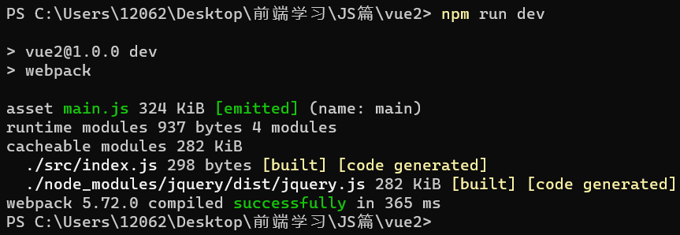
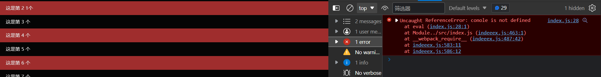
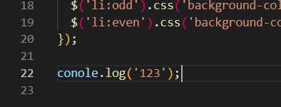
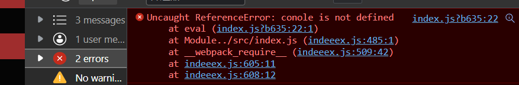
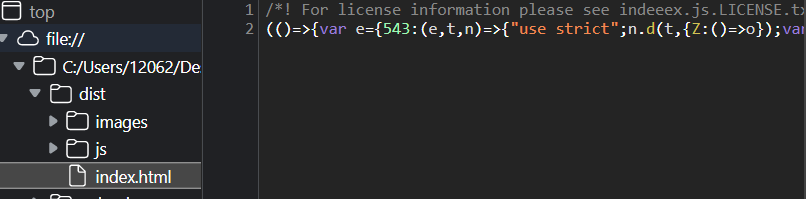
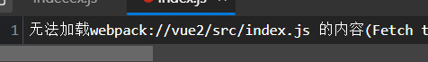
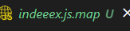
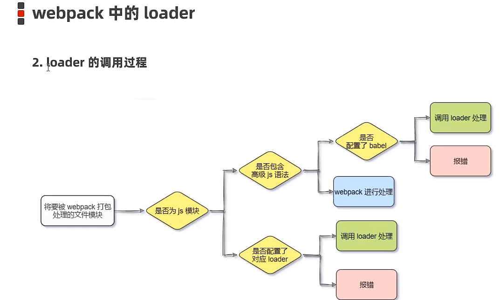
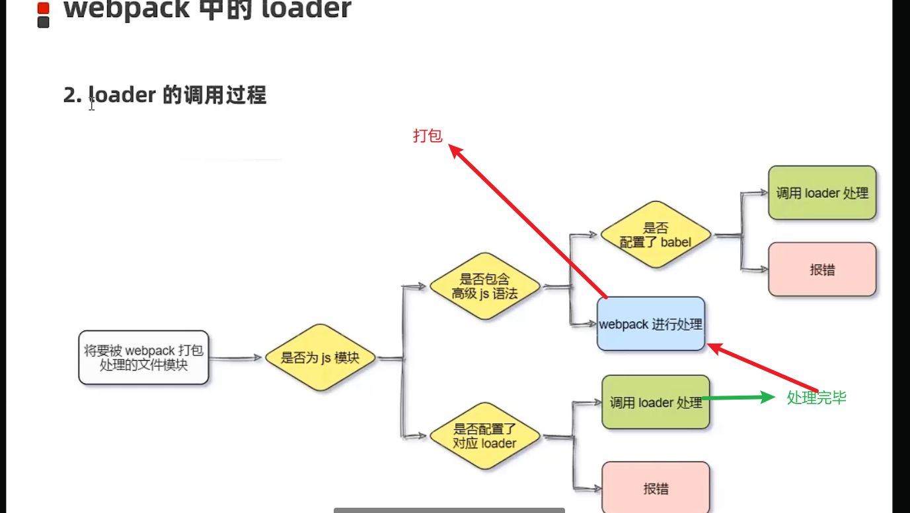

# 准备阶段

# 准备阶段

## 前端工程化与Webpack

---

工作中的前端开发：

工程化的开发 ：在企业级的前端项目开发中，把前端开发所需的工具、技术、流程、经验等进行规范化、标准化。

●模块化  (JS的模块化、CSS的模块化、资源的模块化)
●组件化（复用现有的UI结构、样式、行为）
●规范化（目录结构的划分、编码规范化、接口规范化、文档规范化、Gt分支管理）
●自动化（自动化构建、自动部署、自动化测试）

### Webpack

webpack是前端项目工程化的具体解决方案。

主要功能：提供模块化开发支持，代码压缩混淆，处理浏览器JavaScript的兼容性，性能优化等

代码压缩 把注释空格全部删除

兼容性的处理 会把 es6等高级的语法转化为低级的语法 使得能在各个版本中运行

在实际开发中是不会在html用link引用，而是通过webpack的入口js index.js 进行导入

对js文件的处理流程

> 📌本次学习是基于以下版本学习，不同版本可能会导致报错

```JavaScript
{
  "name": "vue2",
  "version": "1.0.0",
  "description": "",
  "main": "index.js",
  "scripts": {
    "test": "echo \"Error: no test specified\" && exit 1",
    "dev": "webpack server"
  },
  "keywords": [],
  "author": "",
  "license": "ISC",
  "dependencies": {
    "jquery": "^3.6.0",
    "path": "^0.12.7"
  },
  "devDependencies": {
    "@babel/core": "^7.14.6",
    "@babel/plugin-proposal-decorators": "^7.14.5",
    "babel-loader": "^8.2.2",
    "css-loader": "^4.1.1",
    "file-loader": "^6.2.0",
    "html-webpack-plugin": "^5.3.2",
    "less": "^4.1.1",
    "less-loader": "^10.0.1",
    "style-loader": "^3.0.0",
    "url-loader": "^4.1.1",
    "webpack": "^5.42.1",
    "webpack-cli": "^4.9.0",
    "webpack-dev-server": "^3.11.2"
  }
}


```

这里面的script 关键字 通过 npm run xxx运行

#### webpack 的使用

初始化项目，使用npm包也需要初始化。

```JavaScript
//初始化，包管理文件
npm init -y 
//创建src目录存放源代码 js html 文件
```

安装webpack （以前是内置cli 现在被分离）

```JavaScript
npm i webpack webpack-cli
```

在项目中配置webpack

> 在根目录中创建 webpack.config.js 的配置文件 ,并初始化,向外导出webpack的配置对象，development只会处理兼容性还没压缩，production处理 压缩，把注释等全部删除   dev快速 pro慢压缩高，

```JavaScript
//mode用来指定构建模式。可选值有development和production 开发模式和上线模式
  module.exports = {
  mode: 'development'
};

```

在package.json的scripts节点下 新增dev脚本

> script节点下的脚本，可以通过npm run执行。例如npm run dev ，dev是名字，可以自定义就是用来快速执行的

```JavaScript
  "scripts": {
     "dev":"webpack"
  },
```

运行webpack

> 终端中运行

```JavaScript
npm run dev
```

运行成功



> 实际运行时 是先去js里看是什么模式pro 还是dev  然后才会运行webpack

在webpack4.×和5.×的版本中，有如下的默认约定：

```Plain
默认的打包入口文件为src->index.js
默认的输出文件路径为dist->main.js

注意：可以在webpack.config.js中修改打包的默认约定
```

自定义打包的入口和出口

> 在当前版本中 不能直接在entry中直接写路径拼接，而是通过变量去赋值,output出来的位置是内存而不是硬盘，在文件里找不到，但是能用网站访问到   输出到    "  /  "

需要把html的js路径改为  /xxx.js

```JavaScript
const path = require('path');
var entrypath = path.join(__dirname, './src/changge.js');
//向外导出webpack的配置对象
module.exports = {
  mode: 'production', //mode用来指定构建模式。可选值有development和production

  //自定义webpake打包和输出路径 ,注意要先导入path才能用
  entry: entrypath,
  //输出地址
    output: {
    //指定存放的目录
    path: path.join(__dirname + '/dist/babi'),
    //指定生成的文件名
    filename: 'indexzz.js',
  },
  
};

```

导入打包和构建过后的js

> 📌在dist文件中的 dist/main.js

```JavaScript
 <script src="../dist/main.js"></script>
 //设置js导出路径
  output: {
    //指定存放的目录
    path: path.join(__dirname + '/dist'),
    //指定生成的文件名
    filename: 'js/indexzz.js',
    //设置图片导出路径
    {
        test: /\.jpg|png|gif$/,
        //貌似现在的limit是已经被设置了。所以需要我们改回来防止变成base64
        use: 'url-loader?limit=1&outputPath=image'
      },
```

项目上线打包发布

修改 package.json，

—mode是一个参数项，用来指定webpack的运行模式。production代表生产环境，会对打包生成的文件进行代码压缩和性能优化。这里没有加server所以打包完成的文件会自动生成一个文件夹

```JavaScript
  "scripts": {
    "test": "echo \"Error: no test specified\" && exit 1",
    "dev": "webpack server",
    //这里的 --mode 比webpack里面的优先级更高 ，build是自定义的 名字
    "build":"webpack --mode production"
  },
```

#### 自动化工具

> 修改源文件时自动打包和构建的工具 webpack-dev-server  ,有点类似于nodemon

使用方法：npm 安装 配置 运行  ，在浏览器中访问(可修改，在下面)http://localhost:8080地址，查看自动打包效果
注意：webpack-dev-server会启动一个实时打包的http服务器

```JavaScript
npm webpack-dev-server -D 

//在package.json中配置（接着上次写就行）
"dev": "webpack server"

```

webpack插件

> devServer节点 ，开启后保存修改文件自动打开网页预览

```JavaScript
module.exports = {
  mode: 'production', 
  devServer: {
  //首次打包成功后打开浏览器
  open: true,
  //文件访问地址
  host: '127.0.0.1',
  //端口号
  port: 80,
},
  },


```

#### 自动将构建好的代码复制到http://localhost:8080/目录下，这样打开就能预览不需要再次手动打开

html-webpack-plugin 安装配置运行

```JavaScript
npm i html-webpack-plugin  -D
```

在webpack-config.js中配置

```JavaScript
const htmlplugin = require('html-webpack-plugin');

//构造实例对象
const htmlp = new htmlplugin({
  //指定要复制的文件
  template: './src/index.html',
  //指定复制出来的文件名和存放路径
  filename: './index.html',
});

module.exports = {
  mode: 'development', 
  //调用这个对象
  plugins: [htmlp],
};


```

打包发布时，需要输出多次进行测试，每次都得删了才能打包，否则会混淆，所以需要以一个自动清除的工具

## clean-webpack-plugin

> 官网教用

```JavaScript
https://www.npmjs.com/package/clean-webpack-plugin
//解构赋值 的、把包里面属性全部拆出来赋值给这个新对象
const { CleanWebpackPlugin } = require('clean-webpack-plugin');
 plugins: [htmlp, new CleanWebpackPlugin(),],

```

source Map

> 这是一个信息文件，存储着位置信息，在代码压缩混淆后，报错的位置和源文件中代码的位置不一致，就不好改，所以需要一个记录转换前后位置的工具，报错时直接显示源代码的位置





在webpack.config.js添加

```JavaScript
module.exports = {
//显示报错源代码位置，在打包上线时要把这行代码删掉，否则会导致源代码泄露，这个因为能浏览源文件
//开发时使用这个
devtool:"eval-source-map",
//设置 只指定源代码错误行，但在浏览器中直接不显示源码，正式发布时建议用这个
//发布时使用这个
devtool:"nosources-source-map",
//绝对不要用，直接暴露源代码
devtool:"source-map",
}
```



发布时删掉代码错误位置提示之后的效果，



nosources效果



source文件



#### webpack中的loader加载器

> 在打包的时候不仅有js文件还有其他的，而针对其他的文件和高级es需要使用loader来处理，当发现处理不了的时候会查找webpack.config,js这个文件有没有配置模块能解决，



loader加载器的作用：协助webpack打包处理特定的文件模块。比如：
●Css-loader可以打包处理.css相关的文件
●less-loader可以打包处理.less相关的文件
●babel-loader可以打包处理webpack无法处理的高级JS语法

> 加载器和webpack的关系是相互独立调用，webpack把css文件交给cssloader处理。处理完后再交回webpack ，合并到js文件中，生成打包好的文件， 处理时需要把css 等文件 导入到js文件中，打包完成后不管是cs图片les都会再js文件里，所以需要这么导入

```JavaScript
//这里不需要接收因为会返回undefined
import './css/index.css'
//用logo名字接收，这个内容 
import  logo from './upload/img'
```

安装 css处理器

```JavaScript
npm i style-loader@3.0.0 css-loader@5.2.6 -D
```

webpack.config.js中配置包

> use里面的是loader ，调用顺序是从后往前调用，css处理完后交给style处理

```JavaScript
 module.exports = {
  mode: 'development', 
  //所有第三方文件模块的匹配规则
  module: {
  //文件后缀名的匹配规则
  // rules这里面的顺序是固定的，test标识要匹配的文件类型 use表示对应要调用的loader
    rules: [{ test: /\.css$/, use: ['style-loader', 'css-loader'] }],
  },
  
};


```

```JavaScript
//再js入口文件中导入css样式
//导入css样式 在webpack中 都可以通过es6语法导入,需要第三方loader处理
import './css/index.css';

```

流程



安装 less处理器

> 后面这个包是依赖包，less运行需要这个

```JavaScript
npm i less-loader@10.0.1 less@4.1.1 -D
```

webpack.config.js中配置包,再原css的基础上修改配置即可

```JavaScript
module.exports = {
 mode: 'development', 
 //所有第三方文件模块的匹配规则
 module: {
 //文件后缀名的匹配规则
 // rules这里面的顺序是固定的，test标识要匹配的文件类型 use表示对应要调用的loader
   rules: [{ test: /\.less$/, use: ['style-loader', 'css-loader','less-loader'] }],
 },
 
};

```

```JavaScript
//引入less
import './css/index.less';
```

base64图片编码，

> base64只建议用在小图片上，因为转换之后反倒是体积变大了。解析img标签时是先解析这个代码，然后再去找这个图片进行渲染，base64是直接再解析代码时就能解析，稍微减少请求数量，不需要发起额外请求图片就能出来

```JavaScript
    <!-- 普通图片引入 -->
    
    <!-- base64引入 -->
    
```

处理img文件

下载并配置包

其中？之后的是loader的参数项：
●imit用来指定图片的大小，单位是字节(byte)
●只有s小于等于 limit大小的图片，才会被转为base64格式的图片

```JavaScript
npm i url-loader@4.1.1 file-loader@6.2.0 -D 
②在webpack.config,js的module->rules数组中，添加loader规则如下：
 module:{
    rules:[{test:/\.jpg|png|gif$/,use:'url-loader?limit=22229'}]

```

从jq中导入图片并动态赋值

```JavaScript
//导入图片，
import weixin from '../upload/weixin.png';
//把img标签的src动态赋值
$('.img').attr('src', weixin);

```

处理高级js语法

> 下包 配置 使用

```JavaScript
npm i babel-loader@8.2.2 @babel/core@7.14.6 @babel/plugin-proposal-decorators@7.14.5 -D
```

配置 创建 babel.config.js的配置文件与webpack.config平级，这些代码都不用背，去官网找到就行，知道怎么用去哪找就行

```JavaScript
module.exports ={
//声明babel可用的插件
plugins:[['ebabel/plugin-proposal-decorators',{legacy:true }]]
}
```

exclude是排除掉这些文件不处理，下载下来的包兼容性不需要管他

```JavaScript
{test:/\.js$/,use:'babel-loader',exclude:'./node_modules/'}
```

路径新的表示方法@

> 在开发中基于本身位置的相对路径 ../ ../ 当目录多了之后这样后面找起来有点难度，所以用@基于src目录下去寻在，相对中的绝对路径的意思

```JavaScript
//在webpack最外层module.exports配置 @ 的路径

 resolve:{
    alias:{
            //告诉webpack @是基于哪个位置开始
            '@':path.join(__dirname,'./src/')
    }
  }
  
  index.js中
//引入less ,@是从新定义的一个 位置地点 基于src目录最为起点去寻在
import '@/css/index.less';

//导入图片，
import weixin from '@/upload/weixin.png';
  

```

### 实际项目开发中 并不需要我们去配置webpack 而是使用现有的去一键配置，学习的意义是会造轮子，使用的意义是不重复造轮子

‍

‍

‍
