# 案例

# 案例

### 头条案例

创建项目配置

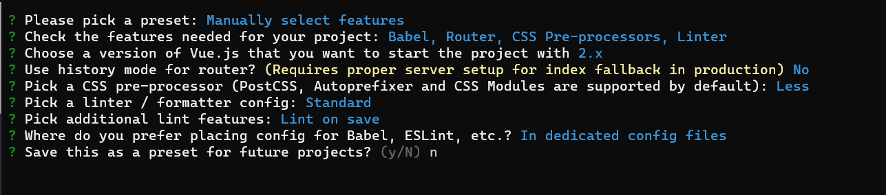

views是存放组件的文件夹，用路由切换加载的组件放这里

components是存放静态可复用的组件

utils是存放工具函数或者是一些方法

在vue.config.js这个配置文件中，可以对整个项目的打包、构建进行全局性的配置

/webpack在进行打包的时候，底层用到了node.js
/因此，在vue.config.js配置文件中，可以导入并使用node.js中的核心模块

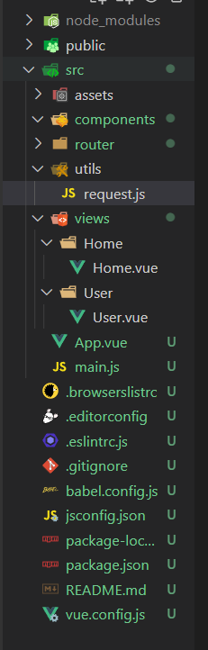

#### 使用Vant组件库

> 组件库就是别人做好的很多小功能 包括导航栏按钮等

[快速上手 - Vant 3 (gitee.io)](https://vant-contrib.gitee.io/vant/#/zh-CN/quickstart#yin-ru-zu-jian)

安装vant

引入组件

> 官网有三种方法，按需引入是比较好的一种,但是配置非常复杂，而实际开发使用的是导入所有组件，开发的时候是不在意体积怎么方便怎么来，项目要上线的时候会用一些操作把 vant抽离出去

#### 导入所有组件（不推荐）

Vant 支持一次性导入所有组件，引入所有组件会**增加代码包体积**，因此不推荐这种做法。

> 在main中配置

```Plain
//导入vue
import { createApp } from 'vue';
//导入vant库
import Vant from 'vant';
//导入配套的样式表
import 'vant/lib/index.css';

const app = createApp();
//把vant安装到vue中
app.use(Vant);
```

布局分析

点击Tabbar 标签栏，切换页面，且标签栏不变，所以是需要把组件展示在上半区是动态变化的路由，放在view文件夹中，上半区用router-view占位，标签栏是router-link链接

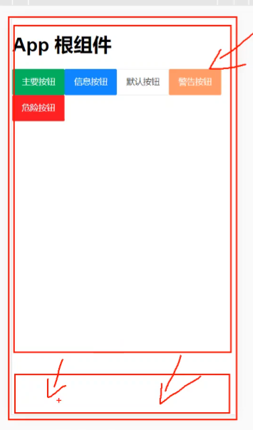

使用vant组件

如果使用了按需导入就要用一次引入一次，如果是安装了全部，就可以直接使用，复制粘贴代码演示即可

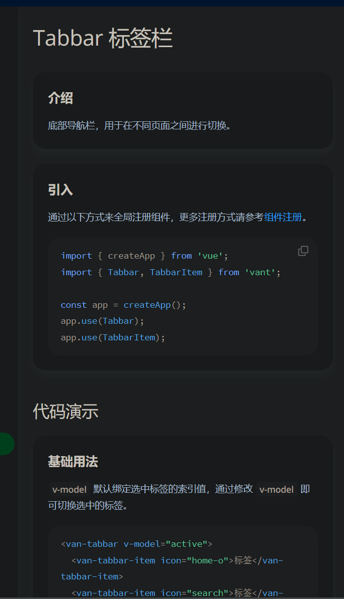

如果用路由模式管理点击和高亮就要把 v-model="active"去掉 js部分不要

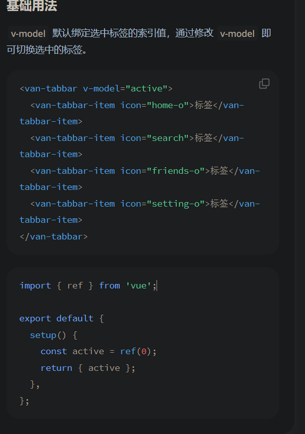

#### 更改一些组件的图标

icon就是图标，如果需要更改在vant的基础组件 图标中复制图标名称切换即可

#### 设置为路由链接

默认下只是一个标签，并没有链接和切换的功能

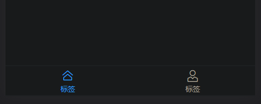

在这个组件的下面有路由模式，切换即可

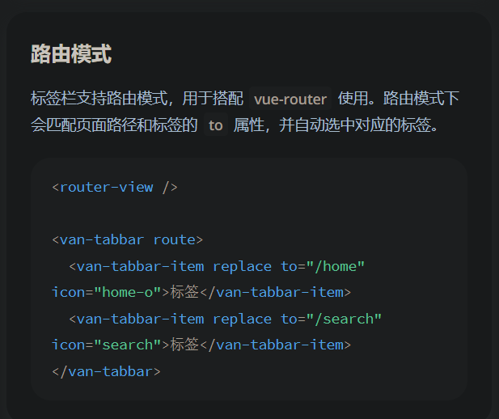

#### 导入组件高亮问题

> 用路由模式时，未配置路由规则时，点击会跳转到对应的hash地址，但是不会高亮，配置规则后高亮就生效

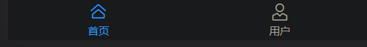

#### api

设置组件的一些属性可通过api，教程在下面

当使用固定定位时，会导致脱离，然后其他元素会顶上去被遮住，所以用placeholder属性顶开一个等高的距离(相当于加了padd)

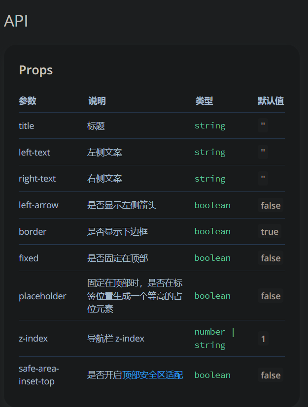

#### 修改样式

> 修改样式在最下方的主题定制,一般使用覆盖

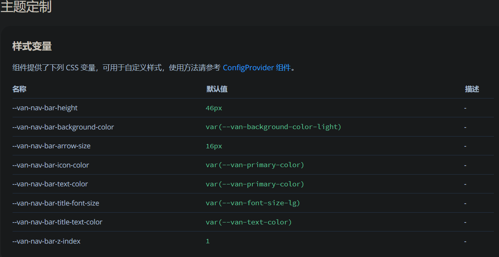

#### /deep/

> 在修改样式时，因为使用scoped会随机生成自定义属性，导致直接用类选择器无法选中,加上/deep/时就会在类名前加上    [当前的自定义属性]  .类名 从而选中

vant组件简写

二次封装

> 二次封装，每次调用都是一个独立axios ，提高复用

#### api接口调用的复用

> 为了提高复用性，把从服务器获取信息的函数抽离出来，放到api文件夹下单独的一个js文件

组件调用时

循环渲染组件

> 组件的写法也是使用item.xxx 即可，

接收传输过来的props参数时

命名规范

### 打包发布

1. 在终端下运行如下的打包命令：

```JavaScript
npm run build
```

构建完成后，文件夹中会多出一个dist文件，就是打包之后的文件。

默认情况下只有在http协议下打开这个网页文件，需要修改vue cli才能在本地直接用file打开

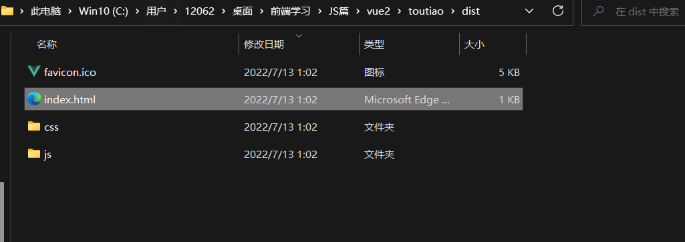

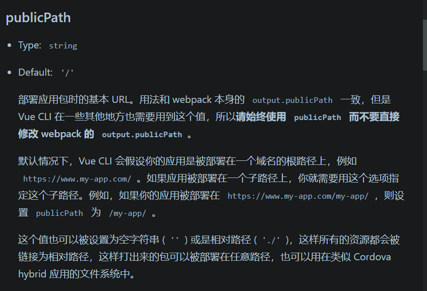
